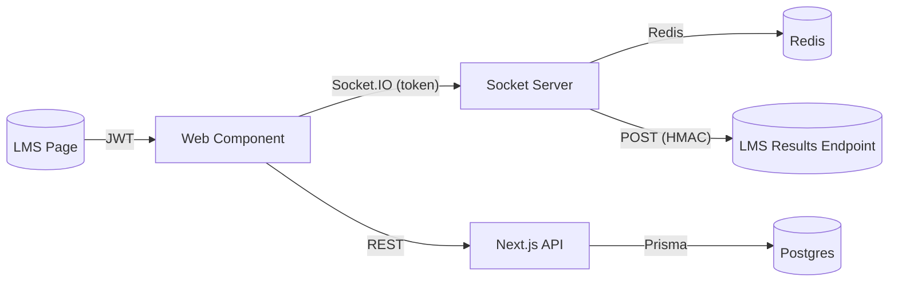

# LMS Integration Guide (Web Component + JWT SSO)

This guide explains how to integrate the Kahoot Clone app into your LMS without iframes, using a Web Component (`<kahoot-host>`) and JWT-based SSO.

The integration is additive: all existing app flows continue to work. The LMS path gives teachers full host controls directly inside the LMS.

---

## Overview

- Host UI is exposed as a Web Component that your LMS can embed on any page.
- Authentication is JWT SSO: the LMS issues a teacher token. The socket server validates and authorizes host commands.
- Questions can be imported via an API or via the Web Component helper method.
- Results can be sent back to the LMS via an HTTP webhook at session end.



---

## Prerequisites

- LMS can render a script tag and custom element on a page.
- LMS can generate a JWT for the teacher (`role: 'TEACHER'`).
- Configure allowed origins for CORS.

---

## Environment Configuration

In the Kahoot Clone app, set the following variables:

- `NEXT_PUBLIC_APP_URL` (e.g., `http://localhost:3000`)
- `NEXT_PUBLIC_SOCKET_URL` (e.g., `http://localhost:3001`)
- `JWT_SECRET` (HS256 shared secret for MVP; can be upgraded to RS256 + JWKS later)
- `LMS_ALLOWED_ORIGINS` (CSV, e.g., `http://aans.localhost:3005`)
- `RESULTS_WEBHOOK_SECRET` (optional, used to sign results callback payloads)

The server is additionally hard-coded to allow `http://aans.localhost:3005` by default.

---

## JWT SSO

- Token must include the following claims (see `lib/auth.ts` `JWTPayload`):
  - `userId: string`
  - `email: string`
  - `role: 'TEACHER'`
- For MVP we use HS256 with `JWT_SECRET`. Example (on LMS):

```js
import jwt from 'jsonwebtoken';
const token = jwt.sign(
  { userId: 'teacher-123', email: 't@example.com', role: 'TEACHER' },
  process.env.KAHOOT_JWT_SECRET, // must match this app's JWT_SECRET
  { expiresIn: '7d' }
);
```

The socket handshake reads the token and authorizes `host:*` events only for teachers.

---

## Web Component Usage

Include the component on the LMS page (no bundler coupling):

```html
<script type="module" src="https://YOUR_APP_ORIGIN/kahoot-host.js"></script>

<kahoot-host
  token="YOUR_JWT"
  api-base-url="https://YOUR_APP_ORIGIN"
  socket-url="https://YOUR_SOCKET_ORIGIN"
  results-callback-url="https://aans.localhost:3005/api/kahoot/results"
></kahoot-host>
```

Initialize and control the session:

```html
<script type="module">
  const el = document.querySelector('kahoot-host');
  await el.connect();

  // Option A: Import questions through component
  const { questionSetId } = await el.importQuestions({
    provider: 'your-lms',
    courseId: 'COURSE-123',
    assignmentId: 'ASSIGN-456',
    questionSet: {
      title: 'Quiz 1',
      description: 'Week 1 quiz',
      questions: [
        {
          text: '2 + 2 = ?',
          timeLimit: 30,
          points: 1000,
          choices: [
            { text: '3' },
            { text: '4', isCorrect: true },
            { text: '5' },
            { text: '22' },
          ],
        },
      ],
    },
  });

  const { sessionId, code } = await el.createSession({ questionSetId });
  console.log('PIN:', code);
  await el.start();
  // await el.next();
  // await el.end();

  el.addEventListener('session-created', (e) => console.log('created', e.detail));
  el.addEventListener('question-started', (e) => console.log('question-started', e.detail));
  el.addEventListener('question-ended', (e) => console.log('question-ended', e.detail));
  el.addEventListener('session-ended', (e) => console.log('session-ended', e.detail));
  el.addEventListener('error', (e) => console.error('host error', e.detail));
</script>
```

### Attributes / Properties

- `token: string` (required)
- `api-base-url: string` (optional; defaults to current origin)
- `socket-url: string` (optional; defaults to `NEXT_PUBLIC_SOCKET_URL` or localhost)
- `session-id: string` (optional)
- `question-set-id: string` (optional)
- `results-callback-url: string` (optional)

### Methods

- `connect()`
- `importQuestions(payload)` → `{ questionSetId }`
- `createSession({ questionSetId })` → `{ sessionId, code }`
- `attach(sessionId)`
- `start()`
- `next()`
- `end()`
- `destroy()`

### Events

- `ready`
- `session-created`
- `player-joined`
- `question-started`
- `question-ended`
- `leaderboard-updated`
- `session-ended`
- `error`

---

## API Endpoints

- `POST /api/lms/import-questions`
  - Auth: `Authorization: Bearer <teacher JWT>`
  - Body: `{ provider?, courseId?, assignmentId?, questionSet: { title, description?, questions: [{ text, timeLimit?, points?, choices: [{ text, isCorrect?, color? }] }] } }`
  - Response: `{ success: true, questionSetId }`

- `POST /api/lms/create-session`
  - Auth: `Authorization: Bearer <teacher JWT>`
  - Body: `{ questionSetId, resultsCallbackUrl? }`
  - Response: `{ success: true, sessionId, code }`

CORS is enabled for `http://aans.localhost:3005` and any origins listed in `LMS_ALLOWED_ORIGINS`.

---

## Results Webhook

When the session ends, the server posts:

```json
{
  "sessionId": "...",
  "code": "ABC123",
  "hostId": "...",
  "questionSetId": "...",
  "startedAt": "2025-09-20T00:00:00.000Z",
  "endedAt": "2025-09-20T00:05:00.000Z",
  "leaderboard": [
    { "playerId": "p1", "displayName": "Alice", "score": 2500, "rank": 1 }
  ]
}
```

If `RESULTS_WEBHOOK_SECRET` is set, requests include header `X-Kahoot-Signature` with an HMAC SHA256 of the JSON body.

Example verification (Node):

```js
import crypto from 'crypto';

const signature = req.headers['x-kahoot-signature'];
const expected = crypto
  .createHmac('sha256', process.env.RESULTS_WEBHOOK_SECRET)
  .update(JSON.stringify(req.body))
  .digest('hex');

if (signature !== expected) return res.status(401).send('Invalid signature');
```

---

## Security Notes

- Keep `JWT_SECRET` private. For production multi-tenant, migrate to RS256 + JWKS.
- Limit CORS to known LMS domains via `LMS_ALLOWED_ORIGINS`.
- Maintain rate limits and PIN backoff (already baked into the server).
- Prefer short-lived tokens; rotate secrets periodically.

---

## Troubleshooting

- "Unauthorized: Only teachers can create sessions": Ensure token has `role: 'TEACHER'` and is passed correctly.
- CORS errors: Add your LMS origin to `LMS_ALLOWED_ORIGINS` and restart.
- No results delivered: Check `resultsCallbackUrl`, server logs, and signature verification.
- Players can’t join: Verify PIN (`code`) and that the socket server is reachable from clients.

---

## Reference

- Web Component: `public/kahoot-host.js`
- Socket server: `server/socket-server.ts`
- APIs: `app/api/lms/import-questions/route.ts`, `app/api/lms/create-session/route.ts`
