# Gabay Accounting System - Visual Diagrams

## System Architecture Diagram

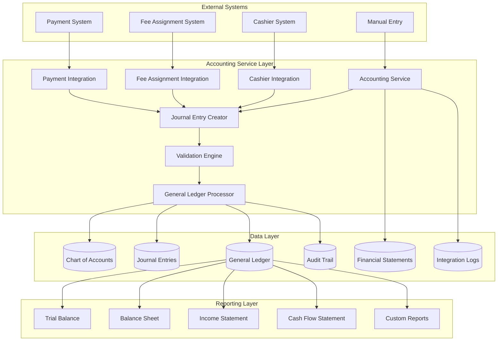

## Double-Entry Bookkeeping Flow

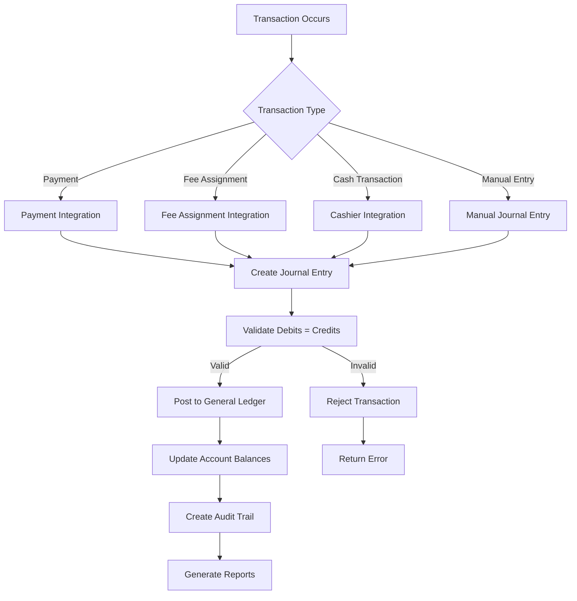

## Journal Entry Processing Workflow

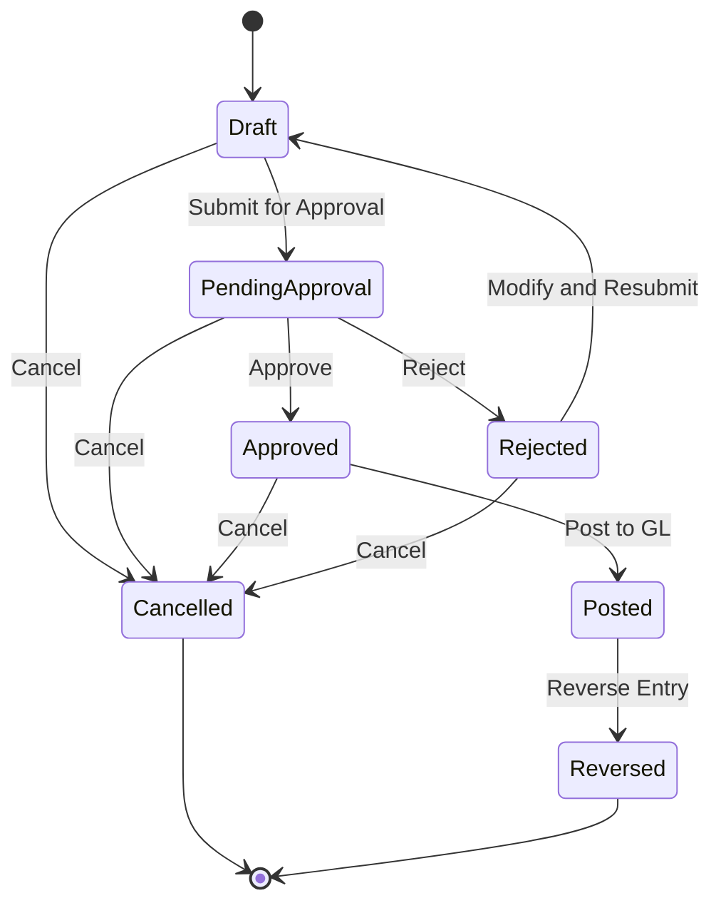

## Account Balance Calculation Flow

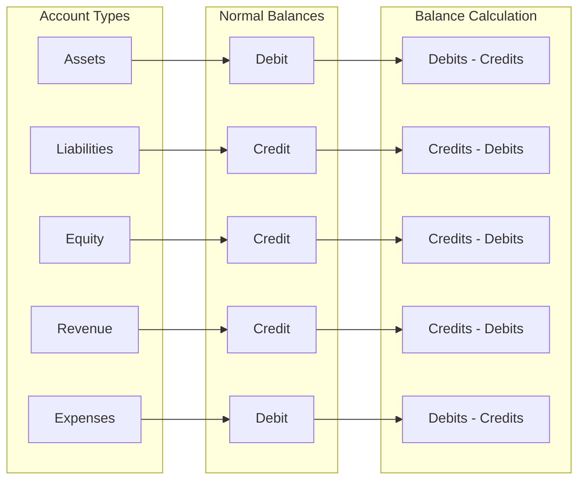

## Payment Integration Flow

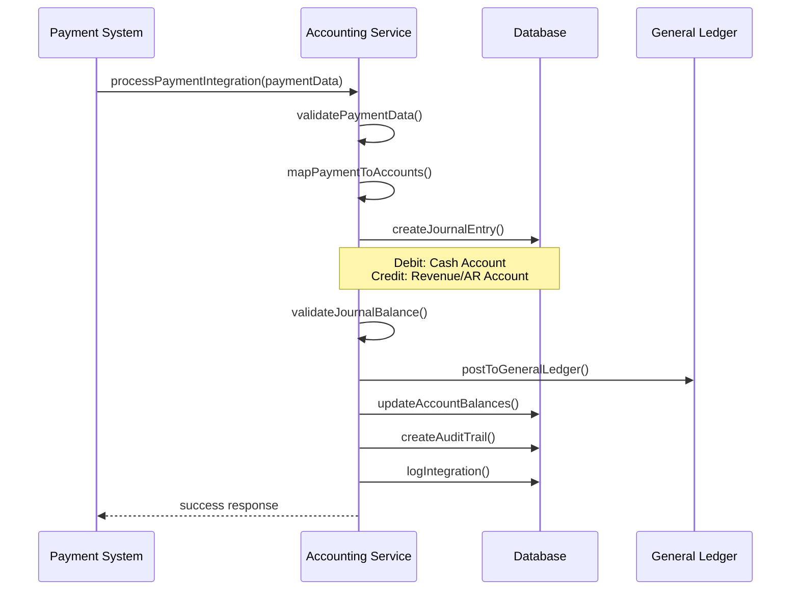

## Fee Assignment Integration Flow

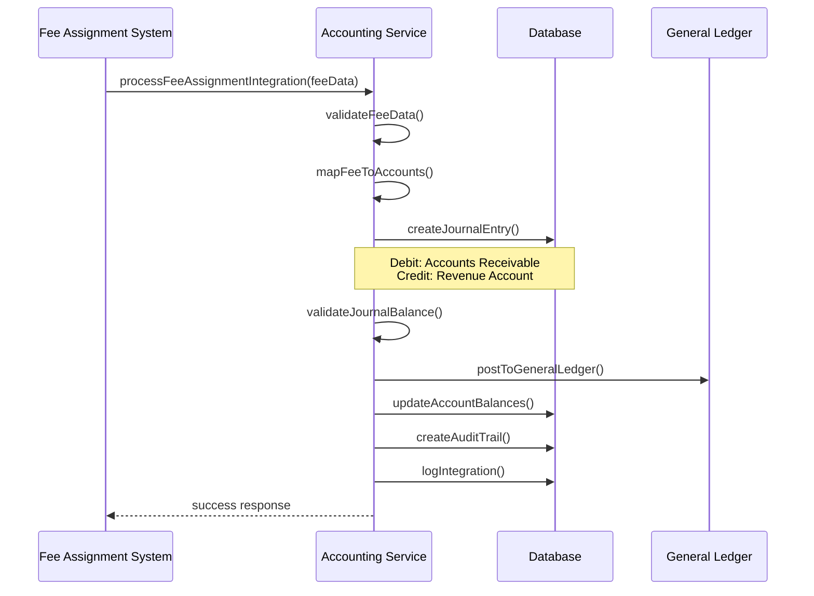

## Financial Statement Generation Process

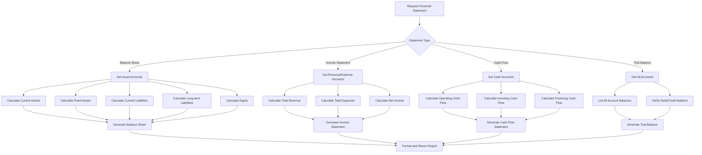

## Data Validation and Error Handling

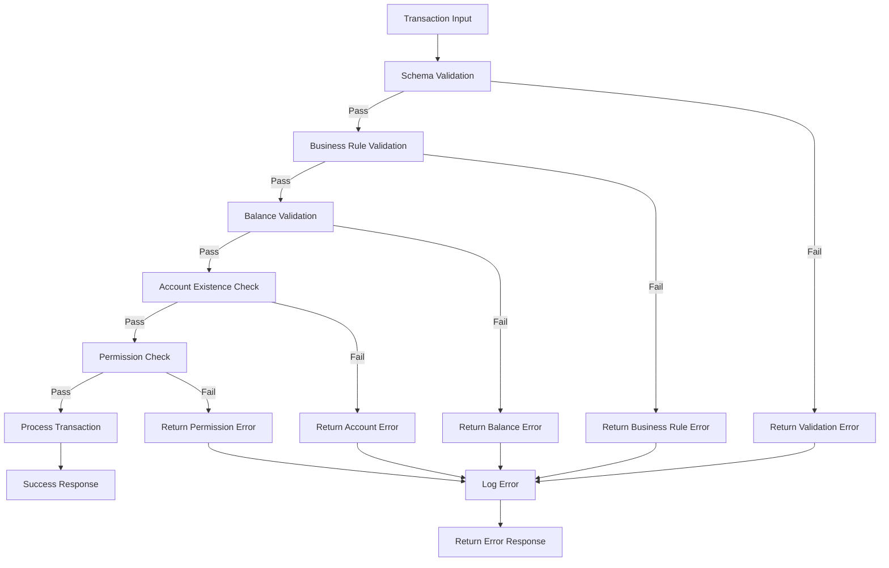

## Audit Trail and Compliance

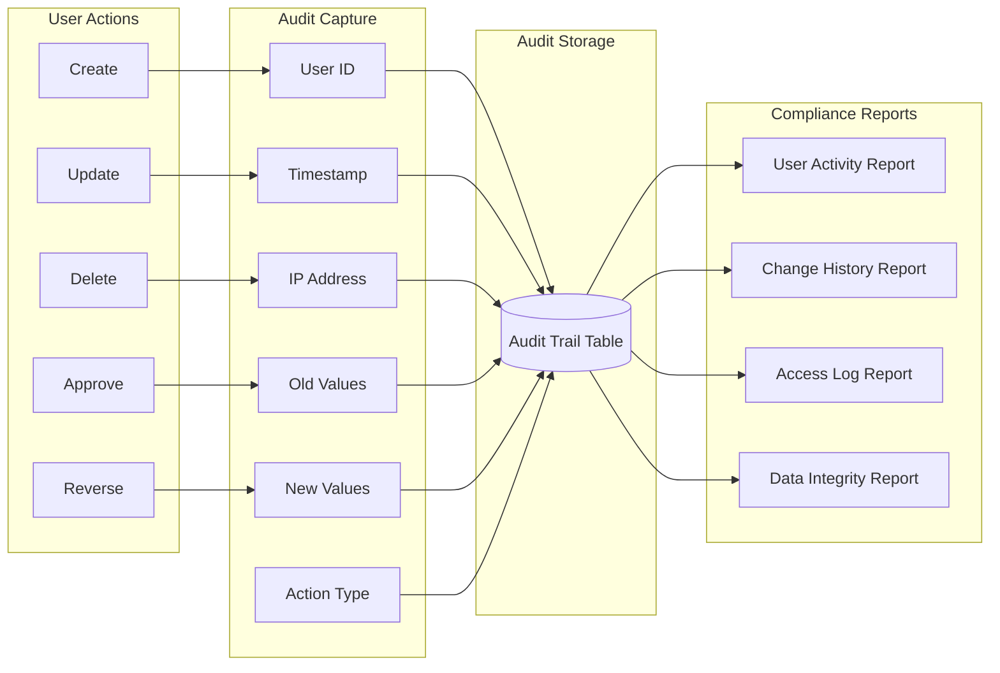

## Bank Reconciliation Process

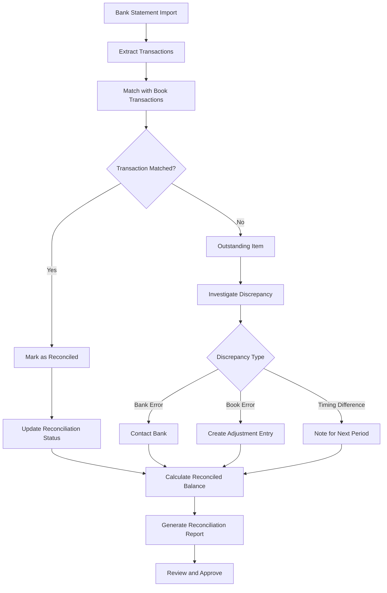

## Chart of Accounts Hierarchy

```mermaid
graph TD
    A[Chart of Accounts] --> B[1000-1999: Assets]
    A --> C[2000-2999: Liabilities]
    A --> D[3000-3999: Equity]
    A --> E[4000-4999: Revenue]
    A --> F[5000-5999: Expenses]
    
    B --> B1[1000-1099: Current Assets]
    B --> B2[1100-1199: Inventory]
    B --> B3[1200-1999: Fixed Assets]
    
    B1 --> B11[1010: Cash - Operating]
    B1 --> B12[1020: Cash - Savings]
    B1 --> B13[1030: Accounts Receivable]
    B1 --> B14[1040: Prepaid Expenses]
    
    C --> C1[2000-2099: Current Liabilities]
    C --> C2[2100-2999: Long-term Liabilities]
    
    C1 --> C11[2010: Accounts Payable]
    C1 --> C12[2020: Accrued Expenses]
    C1 --> C13[2030: Unearned Revenue]
    
    D --> D1[3010: Owner's Equity]
    D --> D2[3020: Retained Earnings]
    
    E --> E1[4000-4099: Tuition Revenue]
    E --> E2[4100-4199: Fee Revenue]
    E --> E3[4200-4299: Other Revenue]
    
    F --> F1[5000-5099: Operating Expenses]
    F --> F2[5100-5199: Administrative Expenses]
    F --> F3[5200-5299: Facility Expenses]
```

## Integration Error Handling

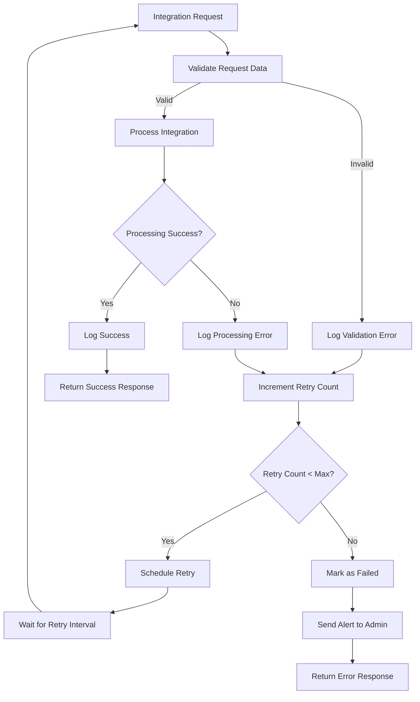

## Performance Monitoring

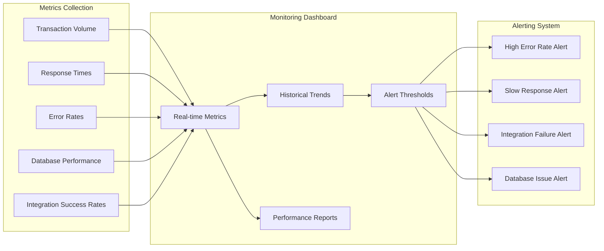

## Security and Access Control

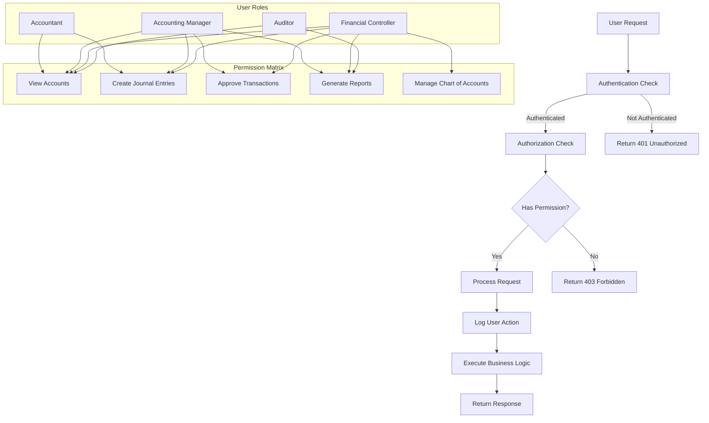

These diagrams provide a comprehensive visual representation of the Gabay Accounting System's architecture, data flow, and operational processes. They complement the main documentation and help stakeholders understand the system's complexity and integration points.