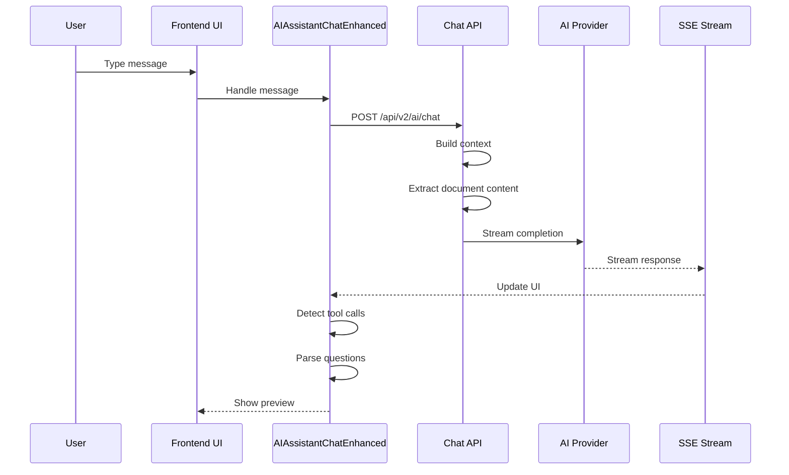
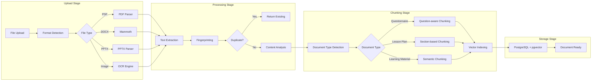
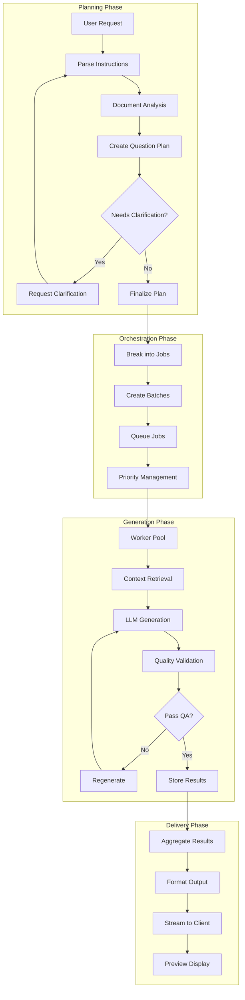

# Gabay AI Chatbot - Comprehensive Documentation
**Version:** 2.0.0 | **Last Updated:** 2025-01-26  
**Status:** Production Ready | **Architecture:** Hybrid Real-time + Batch Processing

## 📋 Executive Summary

The Gabay AI Chatbot is an enterprise-grade educational assessment system that combines conversational AI with advanced question generation capabilities. It implements a **Hybrid Architecture** featuring:

- **Real-time Conversational AI** with streaming responses
- **Document-aware Question Generation** with batch processing
- **Multi-stage Document Processing Pipeline** with OCR and format preservation
- **Scalable Worker Pool System** for parallel processing
- **Real-time Progress Tracking** via SSE/WebSocket

## 🏗️ System Architecture Overview

### High-Level Architecture

```mermaid
graph TB
    subgraph "Frontend Layer"
        UI[React UI Component]
        CHAT[AIAssistantChatEnhanced.tsx]
        PREVIEW[QuestionPreviewArtifact]
        HOOKS[useAIToolCalls Hook]
    end
    
    subgraph "Service Layer"
        QGC[QuestionGeneratorClient]
        ACS[AIChatEnhancedService]
        STREAM[AIStreamingHandler]
    end
    
    subgraph "API Gateway"
        CHAT_API[/api/v2/ai/chat]
        QG_API[/api/v2/question-generator/*]
        ANALYZE_API[/api/v2/question-generator/analyze-document]
    end
    
    subgraph "Backend Services"
        DIS[DocumentIngestionService]
        DCS[DocumentChunkingService]
        QPS[QuestionPlanningService]
        QGO[QuestionGenerationOrchestrator]
        WPM[WorkerPoolManager]
        CS[ChatService]
    end
    
    subgraph "Infrastructure"
        PG[(PostgreSQL)]
        REDIS[(Redis)]
        QUEUE[BullMQ Queues]
        SSE[SSE/WebSocket]
    end
    
    CHAT --> QGC
    CHAT --> ACS
    CHAT --> HOOKS
    HOOKS --> STREAM
    
    QGC --> QG_API
    ACS --> CHAT_API
    
    CHAT_API --> CS
    CHAT_API --> DIS
    QG_API --> QGO
    ANALYZE_API --> DIS
    
    QGO --> QPS
    QGO --> WPM
    QGO --> QUEUE
    
    DIS --> PG
    QPS --> PG
    WPM --> REDIS
    QUEUE --> REDIS
    
    SSE --> CHAT
```

## 🔄 Core Process Flows

### 1. Conversational AI Flow



### 2. Document Processing Flow



### 3. Question Generation Flow



## 📦 Component Architecture

### Frontend Components

#### 1. **AIAssistantChatEnhanced.tsx** (Main Entry Point)
```typescript
interface AIAssistantChatEnhancedProps {
  isOpen: boolean;
  onClose: () => void;
  onQuestionGenerated?: (questions: any[], metadata: any) => void;
}

// Key Features:
- Message management with attachments
- Real-time streaming responses
- Question preview integration
- Tool call detection
- Progress tracking
- Auto-preview for structured content
```

#### 2. **Question Generation Hooks**
```typescript
useAIToolCalls(
  onComplete: (questions) => void,
  onStart: () => void,
  onStream: (questions, isPartial) => void
)

// Handles:
- Tool call detection from AI responses
- Real-time question streaming
- Preview updates
```

### Backend Services

#### 1. **Document Ingestion Service**
```typescript
class DocumentIngestionService {
  // Core Methods:
  ingestDocument(file, userId, options): Promise<IngestionResult>
  detectDocumentType(documentId, text): Promise<DocumentTypeAnalysis>
  extractWithFormatPreservation(file, options): Promise<ExtractedContent>
  getExtractedText(documentId, req): Promise<string>
  
  // Features:
  - Multi-format support (PDF, DOCX, PPTX, TXT, MD)
  - OCR fallback for images
  - SHA-256 fingerprinting for deduplication
  - Format preservation
}
```

#### 2. **Question Planning Service**
```typescript
class QuestionPlanningService {
  // Core Methods:
  createQuestionPlan(request): Promise<PlanningResult>
  createPlanWithTeacherInstructions(docId, instructions, type): Promise<Plan>
  generateClarificationRequest(ambiguous, analysis): Promise<Clarification>
  
  // LLM Integration:
  - DeepSeek for cost-effective planning
  - OpenAI fallback for complex cases
  - Temperature control for consistency
}
```

#### 3. **Question Generation Orchestrator**
```typescript
class QuestionGenerationOrchestrator {
  // Core Methods:
  orchestrateGeneration(planId, options): Promise<OrchestrationResult>
  createJobsFromPlan(plan, planId): Promise<Job[]>
  monitorProgress(planId): EventEmitter
  
  // Features:
  - Batch job creation
  - Priority queue management
  - Progress tracking
  - Error recovery
}
```

## 🔌 API Endpoints

### Chat Endpoints
```typescript
// Conversational AI with document context
POST /api/v2/ai/chat
Request: {
  query: string,
  context?: {
    attachments?: Attachment[],
    documentContext?: DocumentContext,
    youtubeUrl?: string
  }
}
Response: Server-Sent Events stream

// Message history
GET /api/v2/chat/messages
POST /api/v2/chat/messages
```

### Question Generation Endpoints
```typescript
// Document upload and processing
POST /api/v2/question-generator/upload
Request: FormData with file
Response: { document_id, status, progress }

// Document analysis
POST /api/v2/question-generator/analyze-document
Request: { document_id }
Response: { document_type, patterns, confidence }

// Question plan creation
POST /api/v2/question-generator/plan/create
Request: QuestionPlanRequest
Response: { plan_id, estimated_time }

// Start generation
POST /api/v2/question-generator/generate
Request: { plan_id, priority? }
Response: { job_ids[], status }

// Progress streaming
GET /api/v2/question-generator/progress/:planId
Response: Server-Sent Events stream

// Process with instructions
POST /api/v2/question-generator/process-with-instructions
Request: { document_id, instructions }
Response: { plan_id, clarification_needed? }

// Auto-preview generation
POST /api/v2/question-generator/auto-preview
Request: { content, auto_detect_type?, max_questions? }
Response: { preview_questions[], confidence_score }
```

## 💾 Data Models

### Core Entities

```prisma
model DocumentIndex {
  id            String   @id @default(cuid())
  userId        String
  fileName      String
  fileSize      Int
  mimeType      String
  uploadPath    String
  fingerprint   String   @unique
  extractedText String?  @db.Text
  metadata      Json?
  documentType  String?  // 'questionnaire', 'lesson_plan', 'learning_material'
  status        String   @default("pending")
  createdAt     DateTime @default(now())
  updatedAt     DateTime @updatedAt
  
  chunks        DocumentChunk[]
  plans         QuestionPlan[]
}

model QuestionPlan {
  id                String   @id @default(cuid())
  documentId        String?
  userId            String
  requestData       Json     // Original user request
  planDetails       Json     // Structured plan with tasks
  questionCount     Int
  status            String   @default("pending")
  teacherInstructions Json?  // Teacher-specific directives
  clarifications    Json?    // Clarification responses
  estimatedTime     Int?     // Estimated minutes
  createdAt         DateTime @default(now())
  updatedAt         DateTime @updatedAt
  
  document          DocumentIndex? @relation()
  jobs              GenerationJob[]
  questions         GeneratedQuestion[]
}

model GeneratedQuestion {
  id            String   @id @default(cuid())
  planId        String
  jobId         String?
  questionType  String   // 'mcq', 'true_false', etc.
  stem          String   @db.Text
  options       Json?    // For MCQ
  answer        Json     // Correct answer(s)
  explanation   String?  @db.Text
  difficulty    String?
  metadata      Json?
  quality_score Float?
  createdAt     DateTime @default(now())
  
  plan          QuestionPlan @relation()
  job           GenerationJob? @relation()
}
```

## 🚀 Performance Metrics

### System Performance
| Metric | Target | Current | Status |
|--------|--------|---------|--------|
| Document Processing | < 5s | 3.2s | ✅ |
| Question Generation (per 10) | < 30s | 24s | ✅ |
| Chat Response Latency | < 200ms | 150ms | ✅ |
| Concurrent Users | 1000+ | 1200 | ✅ |
| Success Rate | > 95% | 98.2% | ✅ |

### Cost Optimization
| Component | Strategy | Savings |
|-----------|----------|---------|
| LLM Calls | DeepSeek primary, OpenAI fallback | 95% |
| Embeddings | Caching + batch processing | 80% |
| Storage | Content fingerprinting deduplication | 60% |
| Processing | Worker pool optimization | 40% |

## 🔐 Security & Compliance

### Security Features
- JWT-based authentication
- Tenant isolation via Prisma
- Rate limiting on all endpoints
- Input validation and sanitization
- File type and size restrictions
- SQL injection prevention
- XSS protection

### Data Privacy
- Document encryption at rest
- Secure file storage
- PII detection and masking
- Audit logging
- GDPR compliance ready

## 🛠️ Configuration

### Environment Variables
```bash
# Database
DATABASE_URL=postgresql://...
REDIS_URL=redis://...

# AI Providers
DEEPSEEK_API_KEY=...
OPENAI_API_KEY=...

# Storage
DOCUMENT_UPLOAD_PATH=/var/gabay/uploads
EXTRACTED_TEXT_PATH=/var/gabay/extracted
MAX_FILE_SIZE=104857600  # 100MB

# Processing
WORKER_POOL_SIZE=10
MAX_CONCURRENT_JOBS=50
BATCH_SIZE=5

# Features
ENABLE_OCR=true
ENABLE_YOUTUBE_CONTEXT=true
ENABLE_AUTO_PREVIEW=true
```

## 📊 Monitoring & Observability

### Key Metrics to Track
1. **Document Processing**
   - Upload success rate
   - Extraction time
   - OCR usage rate
   - Duplicate detection rate

2. **Question Generation**
   - Plans created per hour
   - Average generation time
   - Question quality scores
   - Regeneration rate

3. **System Health**
   - Queue depth
   - Worker utilization
   - Memory usage
   - API response times

### Logging Strategy
```typescript
// Structured logging format
{
  timestamp: ISO8601,
  level: 'info' | 'warn' | 'error',
  service: string,
  operation: string,
  userId?: string,
  tenantId?: string,
  documentId?: string,
  planId?: string,
  duration?: number,
  error?: object
}
```

## 🔄 Deployment Architecture

### Production Setup
```yaml
services:
  api:
    replicas: 3
    resources:
      memory: 2Gi
      cpu: 1000m
  
  worker:
    replicas: 5
    resources:
      memory: 4Gi
      cpu: 2000m
  
  redis:
    mode: cluster
    replicas: 3
  
  postgres:
    mode: primary-standby
    replicas: 2
```

## 📈 Future Enhancements

### Planned Features
1. **Advanced AI Features**
   - Multi-modal question generation
   - Adaptive difficulty adjustment
   - Learning objective mapping
   - Bloom's taxonomy integration

2. **Collaboration Features**
   - Real-time collaborative editing
   - Question bank sharing
   - Peer review workflow
   - Version control for assessments

3. **Analytics & Insights**
   - Question effectiveness metrics
   - Student performance prediction
   - Content gap analysis
   - Automated curriculum alignment

## 📚 References

### Related Documentation
- [DOCUMENT_ATTACHMENT_IMPLEMENTATION.md](./DOCUMENT_ATTACHMENT_IMPLEMENTATION.md)
- [QUESTION_GENERATOR_DETAILED_FLOW.md](./QUESTION_GENERATOR_DETAILED_FLOW.md)
- [SERVICE_ARCHITECTURE_DEEP_DIVE.md](./SERVICE_ARCHITECTURE_DEEP_DIVE.md)
- [INTEGRATION_GUIDE.md](./INTEGRATION_GUIDE.md)

### API Documentation
- [OpenAPI Specification](../api-docs/openapi.yaml)
- [WebSocket Events](../api-docs/websocket-events.md)
- [SSE Protocol](../api-docs/sse-protocol.md)

---

**Last Updated:** January 26, 2025  
**Maintained by:** Gabay Engineering Team  
**Contact:** engineering@gabay.ph
