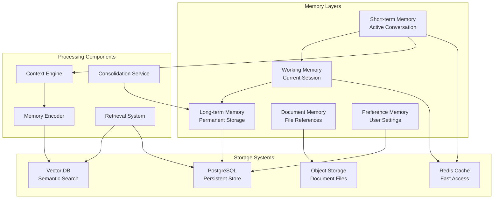

# Context Awareness & Permanent Memory Implementation Plan
**Version:** 1.0.0 | **Date:** 2025-01-26  
**Status:** Implementation Ready | **Priority:** Critical

## 🎯 Executive Summary

This implementation plan addresses the critical context awareness gaps in the Gabay AI Chatbot system, introducing a comprehensive memory management system that enables:

- **Permanent conversation memory** across sessions
- **Document awareness** throughout conversations
- **User preference retention** for personalized experiences
- **Long-term learning** from interactions
- **Context-aware question generation** with full document understanding

## 🔴 Critical Issues to Resolve

### Current State Problems
1. **Document Context Loss** - AI loses awareness of attached documents after initial processing
2. **Limited Message History** - Only 10 messages retained (sliding window)
3. **No Persistent Memory** - All context lost between sessions
4. **Document Reference Failure** - Cannot retrieve previously uploaded document content
5. **Truncated Content** - 8000 char limit loses important information

### Impact on Users
- Teachers must repeatedly re-upload documents
- AI asks for information already provided
- Question generation fails despite having documents
- No learning from previous interactions
- Poor user experience with repetitive clarifications

## 🏗️ Proposed Architecture

### High-Level Memory System Architecture



## 📦 Implementation Components

### 1. Memory Management Service

```typescript
// New service: api/src/services/memory-management.service.ts

interface MemorySystem {
  // Core memory operations
  storeConversationMemory(userId: string, conversation: Conversation): Promise<void>
  retrieveRelevantMemories(userId: string, query: string, limit: number): Promise<Memory[]>
  consolidateMemories(userId: string): Promise<void>
  
  // Document awareness
  linkDocumentToConversation(docId: string, convId: string): Promise<void>
  getDocumentContext(docId: string): Promise<DocumentContext>
  
  // Preference learning
  updateUserPreferences(userId: string, preferences: Preferences): Promise<void>
  getPersonalizedContext(userId: string): Promise<PersonalContext>
}

interface Memory {
  id: string
  userId: string
  type: 'conversation' | 'document' | 'preference' | 'instruction'
  content: string
  embedding: number[]
  metadata: {
    timestamp: Date
    importance: number
    accessCount: number
    relatedDocuments?: string[]
    tags?: string[]
  }
  ttl?: number // Optional time-to-live for temporary memories
}

interface DocumentContext {
  documentId: string
  fullContent: string // No truncation
  summary: string
  keyTopics: string[]
  questionHistory: Question[]
  lastAccessed: Date
  conversationReferences: string[]
}
```

### 2. Enhanced Context Builder

```typescript
// Update: api/src/services/context-builder.service.ts

interface EnhancedContextBuilder {
  buildContext(request: ContextRequest): Promise<EnhancedContext>
}

interface ContextRequest {
  userId: string
  currentMessage: string
  attachments?: Attachment[]
  sessionId: string
  includeMemories: boolean
  memoryDepth: number // How far back to search
}

interface EnhancedContext {
  // Current conversation
  immediateContext: {
    recentMessages: Message[]
    activeDocuments: Document[]
    currentIntent: string
  }
  
  // Retrieved memories
  longTermContext: {
    relevantMemories: Memory[]
    previousDocuments: DocumentReference[]
    userPreferences: Preferences
    historicalPatterns: Pattern[]
  }
  
  // Synthesized context
  synthesizedContext: {
    summary: string
    keyFacts: string[]
    importantDocuments: string[]
    suggestedActions: Action[]
  }
}
```

### 3. Document Reference System

```typescript
// New service: api/src/services/document-reference.service.ts

interface DocumentReferenceSystem {
  // Document registration
  registerDocument(document: Document, userId: string): Promise<string>
  
  // Content retrieval
  getFullDocumentContent(docId: string): Promise<string>
  getDocumentChunks(docId: string, relevantTo: string): Promise<Chunk[]>
  
  // Reference management
  createReference(docId: string, context: ReferenceContext): Promise<Reference>
  resolveReference(refId: string): Promise<Document>
  
  // Search capabilities
  searchDocuments(userId: string, query: string): Promise<Document[]>
  findRelatedDocuments(docId: string): Promise<Document[]>
}

interface Reference {
  id: string
  documentId: string
  conversationId: string
  createdAt: Date
  context: {
    messageId: string
    intent: string
    relevantSections: string[]
  }
}
```

### 4. Conversation Memory Store

```typescript
// New database schema: prisma/schema/memory.prisma

model ConversationMemory {
  id              String   @id @default(cuid())
  userId          String
  conversationId  String
  sessionId       String
  
  // Memory content
  summary         String   @db.Text
  keyPoints       Json     // Array of important points
  decisions       Json     // Decisions made in conversation
  
  // Document associations
  documentIds     String[] // Referenced documents
  generatedQuestions Json  // Questions created
  
  // Metadata
  startTime       DateTime
  endTime         DateTime
  messageCount    Int
  importance      Float    // 0-1 importance score
  
  // Embeddings for retrieval
  embedding       Float[]  @default([])
  
  // Relations
  user            User     @relation(fields: [userId], references: [id])
  documents       DocumentMemory[] @relation("ConvDocuments")
  
  createdAt       DateTime @default(now())
  updatedAt       DateTime @updatedAt
  
  @@index([userId, conversationId])
  @@index([userId, importance])
  @@index([embedding])
}

model DocumentMemory {
  id              String   @id @default(cuid())
  documentId      String   @unique
  userId          String
  
  // Document understanding
  fullContent     String   @db.Text // Full text, no truncation
  summary         String   @db.Text
  documentType    String   // questionnaire, lesson_plan, etc.
  keyTopics       Json     // Extracted topics
  structure       Json     // Document structure analysis
  
  // Usage tracking
  accessCount     Int      @default(0)
  lastAccessed    DateTime
  conversationIds String[] // Conversations that referenced this
  
  // Question generation history
  questionPlans   Json     // All plans created from this doc
  generatedCount  Int      @default(0)
  
  // Embeddings
  embedding       Float[]  @default([])
  chunkEmbeddings Json    // Embeddings for each chunk
  
  // Relations
  user            User     @relation(fields: [userId], references: [id])
  conversations   ConversationMemory[] @relation("ConvDocuments")
  
  createdAt       DateTime @default(now())
  updatedAt       DateTime @updatedAt
  
  @@index([userId, documentId])
  @@index([documentType])
  @@index([lastAccessed])
}

model UserPreferenceMemory {
  id              String   @id @default(cuid())
  userId          String   @unique
  
  // Learned preferences
  questionTypes   Json     // Preferred question types
  difficulty      Json     // Preferred difficulty levels
  formatStyle     Json     // Formatting preferences
  language        String   // Preferred language
  
  // Behavioral patterns
  commonRequests  Json     // Frequently made requests
  clarificationPatterns Json // Common clarifications needed
  
  // Instructions memory
  teacherInstructions Json // Standing instructions
  documentTypes   Json     // Types of documents usually uploaded
  
  // Personalization
  communicationStyle String // Formal, casual, etc.
  responseLength  String   // Brief, detailed, etc.
  
  // Metadata
  learningCount   Int      @default(0) // Number of interactions learned from
  lastUpdated     DateTime @updatedAt
  
  user            User     @relation(fields: [userId], references: [id])
  
  @@index([userId])
}

model SessionState {
  id              String   @id @default(cuid())
  sessionId       String   @unique
  userId          String
  
  // Active context
  activeDocuments String[] // Currently referenced documents
  currentPlan     String?  // Active question plan
  workingMemory   Json     // Temporary working memory
  
  // Conversation state
  conversationId  String
  messageCount    Int
  lastActivity    DateTime
  
  // Intent tracking
  currentIntent   String?
  intentHistory   Json     // Array of detected intents
  
  // Temporary memory
  tempMemory      Json     // Short-term facts
  pendingActions  Json     // Actions to complete
  
  expiresAt       DateTime // Session expiration
  
  @@index([sessionId])
  @@index([userId, lastActivity])
}
```

### 5. Memory Retrieval & RAG Enhancement

```typescript
// New service: api/src/services/memory-retrieval.service.ts

interface MemoryRetrievalService {
  // Semantic search
  searchMemories(query: string, userId: string, options: SearchOptions): Promise<Memory[]>
  
  // RAG enhancement
  enhancePromptWithMemories(prompt: string, memories: Memory[]): string
  
  // Contextual retrieval
  getContextualMemories(context: Context, limit: number): Promise<Memory[]>
  
  // Document-aware retrieval
  getDocumentAwareContext(docId: string, query: string): Promise<DocumentContext>
}

interface SearchOptions {
  types?: MemoryType[]
  dateRange?: DateRange
  minImportance?: number
  includeDocuments?: boolean
  semanticThreshold?: number
  limit?: number
}

// Enhanced RAG pipeline
class EnhancedRAGPipeline {
  async process(query: string, userId: string): Promise<RAGResponse> {
    // 1. Retrieve relevant memories
    const memories = await this.memoryRetrieval.searchMemories(query, userId, {
      types: ['conversation', 'document', 'instruction'],
      limit: 10,
      semanticThreshold: 0.7
    })
    
    // 2. Retrieve document context
    const docContext = await this.getRelevantDocuments(query, userId)
    
    // 3. Get user preferences
    const preferences = await this.getUserPreferences(userId)
    
    // 4. Build enhanced prompt
    const enhancedPrompt = this.buildEnhancedPrompt({
      query,
      memories,
      documents: docContext,
      preferences
    })
    
    // 5. Generate response with full context
    return this.llm.generate(enhancedPrompt)
  }
}
```

## 🔄 Implementation Phases

### Phase 1: Foundation (Week 1-2)
- [ ] Create memory database schema
- [ ] Implement MemoryManagementService
- [ ] Set up vector storage for embeddings
- [ ] Create basic memory CRUD operations

### Phase 2: Document Awareness (Week 3-4)
- [ ] Implement DocumentReferenceSystem
- [ ] Create document memory persistence
- [ ] Build document context retrieval
- [ ] Remove 8000 char limitation

### Phase 3: Conversation Memory (Week 5-6)
- [ ] Implement ConversationMemoryStore
- [ ] Create session state management
- [ ] Build memory consolidation service
- [ ] Implement conversation summarization

### Phase 4: Retrieval & RAG (Week 7-8)
- [ ] Implement MemoryRetrievalService
- [ ] Enhance RAG pipeline with memories
- [ ] Add semantic search capabilities
- [ ] Optimize retrieval performance

### Phase 5: User Preferences (Week 9-10)
- [ ] Implement preference learning system
- [ ] Create personalization engine
- [ ] Build preference UI components
- [ ] Add preference override controls

### Phase 6: Integration & Testing (Week 11-12)
- [ ] Integrate with existing chat system
- [ ] Update frontend components
- [ ] Comprehensive testing
- [ ] Performance optimization

## 🎯 Success Metrics

### Technical Metrics
- **Context Retention**: >95% of document content retained
- **Memory Retrieval Speed**: <100ms for relevant memories
- **Accuracy**: >90% relevant memory retrieval
- **Storage Efficiency**: <10MB per user per month

### User Experience Metrics
- **Reduced Clarifications**: 70% reduction in clarification requests
- **Document Awareness**: 100% document reference success
- **Session Continuity**: Seamless context across sessions
- **User Satisfaction**: >4.5/5 rating

## 🔧 Technical Implementation Details

### 1. Frontend Updates

```typescript
// Update: frontend/src/components/AIAssistantChatEnhanced.tsx

interface AIAssistantChatEnhancedProps {
  // Existing props...
  enableMemory?: boolean
  memoryDepth?: number
  showMemoryIndicators?: boolean
}

// Add memory indicators to UI
const MemoryIndicator: React.FC<{memories: Memory[]}> = ({memories}) => (
  <div className="memory-indicator">
    <Badge variant="secondary">
      <Brain className="w-3 h-3 mr-1" />
      {memories.length} memories active
    </Badge>
  </div>
)

// Add document reference UI
const DocumentReference: React.FC<{documents: Document[]}> = ({documents}) => (
  <div className="document-references">
    {documents.map(doc => (
      <Card key={doc.id} className="document-ref">
        <CardHeader>
          <FileText className="w-4 h-4" />
          <span>{doc.name}</span>
          <Badge>{doc.status}</Badge>
        </CardHeader>
      </Card>
    ))}
  </div>
)
```

### 2. API Endpoint Updates

```typescript
// Update: api/v2/ai/chat
POST /api/v2/ai/chat
{
  "query": "string",
  "context": {
    "attachments": Attachment[],
    "enableMemory": true,
    "memoryDepth": 30, // days
    "sessionId": "string",
    "includeDocumentHistory": true
  }
}

// New: Memory management endpoints
GET /api/v2/memory/user/:userId
POST /api/v2/memory/store
DELETE /api/v2/memory/:memoryId
GET /api/v2/memory/search?q=query&userId=id

// New: Document reference endpoints
GET /api/v2/documents/:docId/full-content
GET /api/v2/documents/:docId/context
POST /api/v2/documents/:docId/reference
GET /api/v2/documents/user/:userId/history
```

### 3. Configuration Updates

```yaml
# Environment variables
ENABLE_MEMORY_SYSTEM=true
MEMORY_EMBEDDING_MODEL=text-embedding-3-small
MAX_MEMORY_RETRIEVAL=20
MEMORY_IMPORTANCE_THRESHOLD=0.5
DOCUMENT_MEMORY_TTL_DAYS=90
CONVERSATION_MEMORY_TTL_DAYS=30
MEMORY_CONSOLIDATION_INTERVAL=3600 # seconds
VECTOR_SIMILARITY_THRESHOLD=0.7
```

## 🚀 Deployment Strategy

### Rollout Plan
1. **Alpha Testing** (Week 1)
   - Deploy to internal testing environment
   - Test with synthetic data
   - Validate memory persistence

2. **Beta Testing** (Week 2-3)
   - Deploy to 5% of users
   - Monitor performance metrics
   - Gather feedback

3. **Gradual Rollout** (Week 4-6)
   - 25% → 50% → 75% → 100%
   - Feature flags for control
   - Rollback plan ready

### Migration Strategy
```sql
-- Migration script for existing data
-- 1. Create memory tables
CREATE TABLE conversation_memories...
CREATE TABLE document_memories...

-- 2. Migrate existing documents
INSERT INTO document_memories (documentId, userId, fullContent...)
SELECT id, userId, extractedText... FROM DocumentIndex;

-- 3. Create indexes for performance
CREATE INDEX idx_memory_embedding ON conversation_memories USING ivfflat (embedding vector_cosine_ops);
```

## 📊 Monitoring & Observability

### Key Metrics to Track
```yaml
Memory System Metrics:
  - memory_storage_size_mb
  - memory_retrieval_latency_ms
  - memory_hit_rate_percent
  - embedding_generation_time_ms
  - consolidation_duration_seconds
  
Document Awareness Metrics:
  - document_reference_success_rate
  - document_retrieval_time_ms
  - context_completeness_score
  
User Experience Metrics:
  - clarification_request_rate
  - context_switch_success_rate
  - session_continuity_score
```

## 🔐 Security Considerations

### Data Protection
- Encrypt memories at rest (AES-256)
- Implement access control per user
- Audit trail for memory access
- GDPR compliance for memory deletion
- PII detection and masking

### Performance Security
- Rate limiting on memory operations
- Prevent memory exhaustion attacks
- Validate embedding dimensions
- Sanitize memory content

## 📝 Testing Strategy

### Unit Tests
```typescript
describe('MemoryManagementService', () => {
  test('should store conversation memory', async () => {})
  test('should retrieve relevant memories', async () => {})
  test('should handle document references', async () => {})
  test('should consolidate memories', async () => {})
})
```

### Integration Tests
- End-to-end memory persistence
- Cross-session context retention
- Document reference resolution
- Memory-enhanced question generation

### Performance Tests
- Memory retrieval under load
- Embedding generation scalability
- Database query optimization
- Cache effectiveness

## 🎉 Expected Outcomes

### Immediate Benefits
1. **No more context loss** - Documents remain accessible throughout conversation
2. **Reduced user frustration** - No need to re-explain or re-upload
3. **Better question generation** - Full document context available
4. **Personalized experience** - System learns user preferences

### Long-term Benefits
1. **Institutional knowledge** - System learns from all interactions
2. **Improved accuracy** - Better understanding through memory
3. **Reduced support tickets** - Fewer issues with context loss
4. **Enhanced user trust** - Consistent, reliable AI behavior

---

**Implementation Priority**: CRITICAL  
**Estimated Timeline**: 12 weeks  
**Resource Requirements**: 2 senior developers, 1 ML engineer  
**Risk Level**: Medium (with proper testing and rollout)

**Next Steps**:
1. Review and approve implementation plan
2. Allocate development resources
3. Set up development environment
4. Begin Phase 1 implementation
