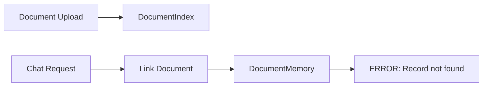
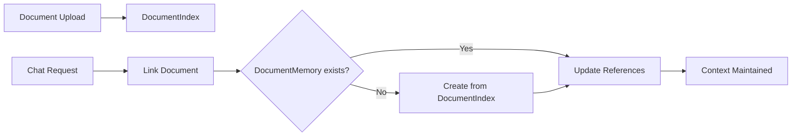

# AI Chatbot Context Loss Issue - Fix Documentation

## Issue Summary
**Date**: January 26, 2025  
**Severity**: High  
**Component**: AI Chatbot Memory Management System

### Problem Description
The AI chatbot was losing conversation context when documents were attached. The system failed to maintain document references across conversation turns, resulting in:
- Document context not being preserved between messages
- PrismaClientKnownRequestError: "Record to update not found" when linking documents to conversations
- Inability to reference previously uploaded documents in ongoing conversations

### Root Cause Analysis

#### Primary Issue
The system attempted to link documents to conversations by updating a `DocumentMemory` record that didn't exist. This occurred because:

1. **Dual Storage Systems**: Documents were stored in `DocumentIndex` (for question generation) but no corresponding `DocumentMemory` record was created
2. **Missing Creation Logic**: The `linkDocumentToConversation` method assumed `DocumentMemory` already existed
3. **Failed Update Operations**: Prisma's `update()` operation failed when trying to update non-existent records

#### Error Log Pattern
```
[ERROR] Failed to link document to conversation PrismaClientKnownRequestError:
Invalid `prisma.documentMemory.update()` invocation:
An operation failed because it depends on one or more records that were required but not found. 
Record to update not found.
```

## Solution Implemented

### 1. Enhanced `linkDocumentToConversation` Method
Modified the method in `memory-management.service.ts` to:
- Check if `DocumentMemory` exists before attempting to update
- Create `DocumentMemory` from `DocumentIndex` if it doesn't exist
- Extract document content from file system when creating new memory
- Handle errors gracefully without breaking chat flow

#### Key Changes:
```typescript
async linkDocumentToConversation(docId: string, convId: string, userId?: string): Promise<void> {
  // 1. Check if DocumentMemory exists
  let documentMemory = await this.prisma.documentMemory.findUnique({
    where: { documentId: docId }
  });

  // 2. Create from DocumentIndex if missing
  if (!documentMemory) {
    const documentIndex = await this.prisma.documentIndex.findUnique({
      where: { id: docId }
    });
    
    // 3. Extract content and create DocumentMemory
    documentMemory = await this.prisma.documentMemory.create({
      data: {
        documentId: docId,
        userId: userId || 'system',
        fullContent: extractedContent,
        summary: generateSummary(extractedContent),
        // ... other fields
      }
    });
  }
  
  // 4. Link to conversation (existing logic)
}
```

### 2. Updated Chat API Integration
Modified `chat.ts` to:
- Pass `userId` to `linkDocumentToConversation` for proper memory association
- Ensure proper error handling for memory operations

### 3. Error Handling Improvements
- Changed from throwing errors to logging warnings for non-critical memory operations
- Ensures chat functionality continues even if memory linking fails
- Prevents cascading failures in the conversation flow

## Architecture Improvements

### Before Fix


### After Fix


## Testing Recommendations

### Test Scenarios
1. **New Document Upload**: Verify DocumentMemory is created when first referenced
2. **Multiple Conversations**: Ensure document can be linked to multiple conversations
3. **Missing DocumentIndex**: Verify graceful handling when document doesn't exist
4. **Content Extraction**: Test with various document types and sizes

### Verification Steps
```bash
# 1. Start the development server
npm run dev

# 2. Upload a document through the AI chat interface
# 3. Send a message referencing the document
# 4. Check logs for successful memory creation:
#    "[INFO] Created DocumentMemory for document [id]"
#    "[INFO] Linked document [id] to conversation [id]"

# 5. Continue conversation and verify context is maintained
```

## Impact Analysis

### Positive Impacts
- ✅ Conversation context properly maintained with documents
- ✅ No more PrismaClientKnownRequestError for document operations
- ✅ Improved user experience with consistent document references
- ✅ Better memory management and retrieval

### Performance Considerations
- Minimal performance impact as DocumentMemory creation is one-time per document
- File system reads cached after first access
- Non-blocking error handling prevents chat delays

## Future Enhancements

### Recommended Improvements
1. **Batch Creation**: Create DocumentMemory records during document upload process
2. **Content Indexing**: Implement vector embeddings for better semantic search
3. **Memory Cleanup**: Add periodic cleanup for unused DocumentMemory records
4. **Monitoring**: Add metrics for memory creation and linking operations

### Long-term Architecture
Consider unifying the document storage systems:
- Merge DocumentIndex and DocumentMemory models
- Single source of truth for document metadata
- Streamlined memory management pipeline

## Related Files Modified
1. `/api/src/services/memory-management.service.ts` - Enhanced linkDocumentToConversation method
2. `/api/src/pages/api/v2/ai/chat.ts` - Updated to pass userId parameter

## References
- Original Issue: Context loss during conversation with attached documents
- Related Schema: `/api/prisma/schema/memory.prisma`
- Related Schema: `/api/prisma/schema/question-generator.prisma`

---

**Status**: Fix Implemented and Ready for Testing  
**Author**: Gabay Assistant  
**Last Updated**: January 26, 2025
