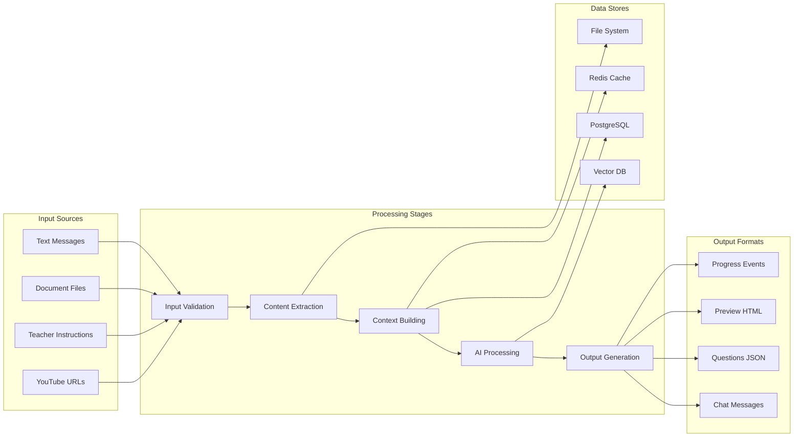
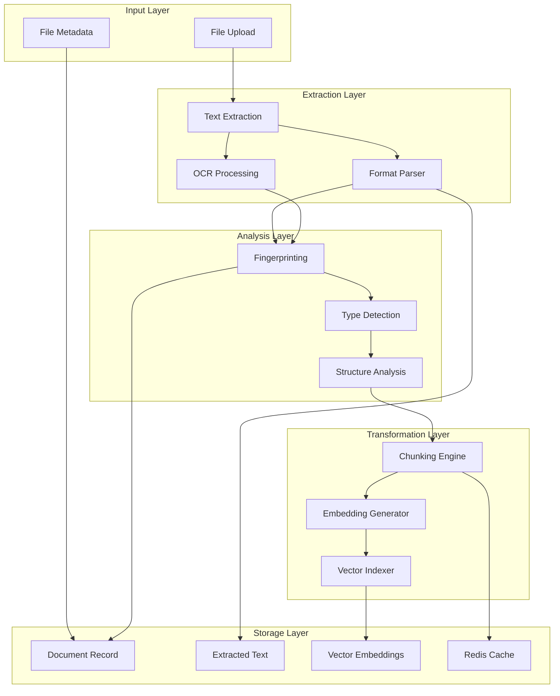
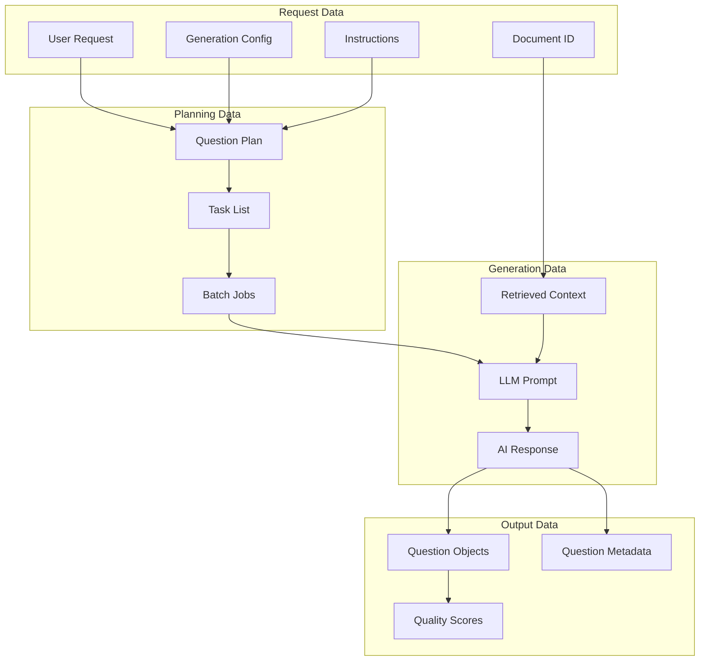
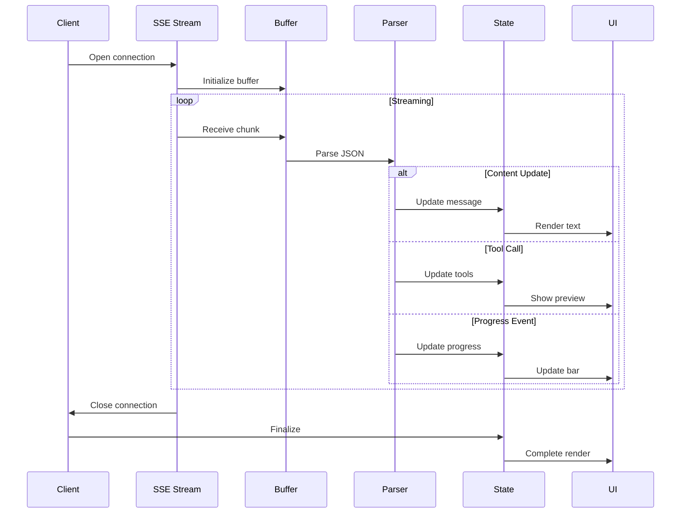
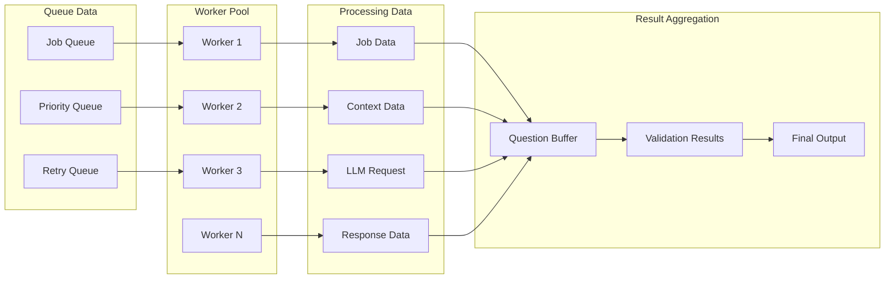
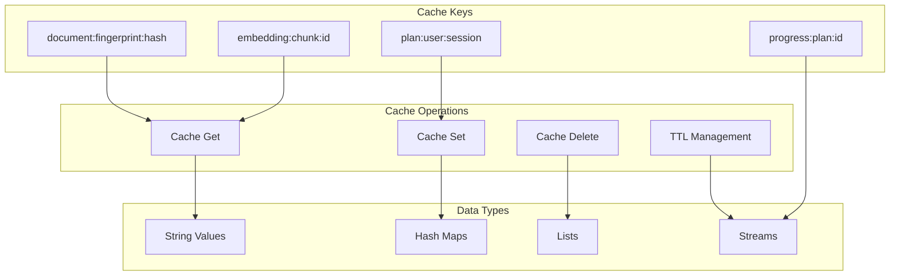
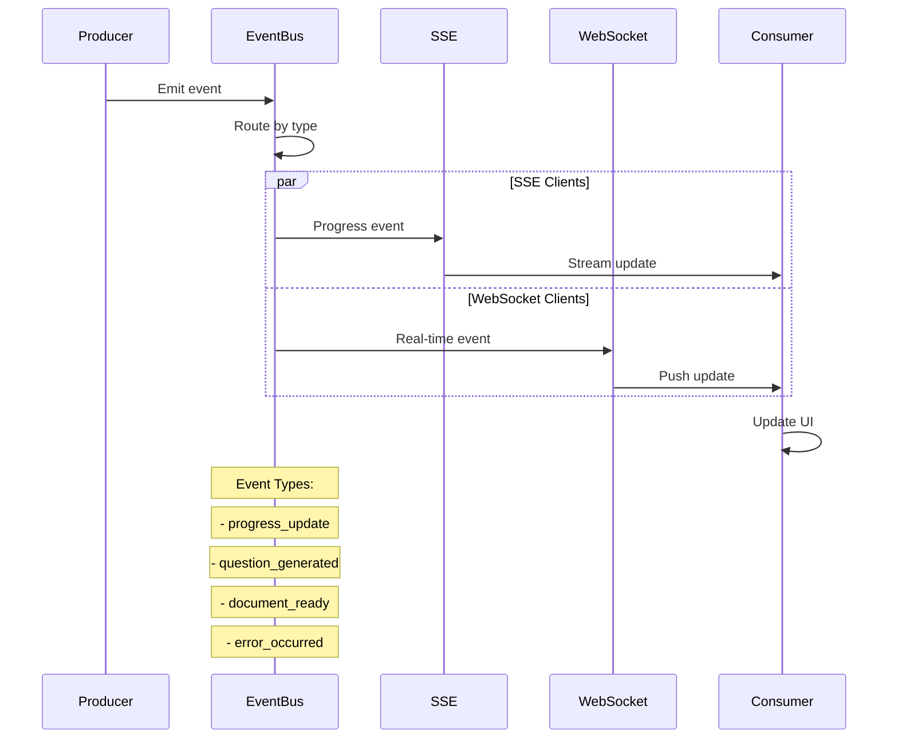
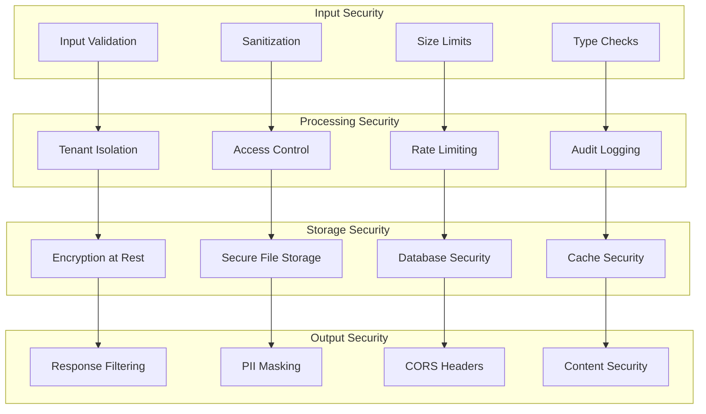

# Gabay AI Chatbot - Data Flow Architecture

## 📊 Data Flow Overview

The Gabay AI Chatbot system processes data through multiple stages, transforming user inputs into structured educational assessments. This document details the complete data flow from input to output.

## 1. Main Data Flow Pipeline



## 2. Document Processing Data Flow



## 3. Question Generation Data Flow



## 4. Real-time Streaming Data Flow



## 5. Context Building Data Flow

```yaml
Input Sources:
  - Current Message:
      type: string
      processing: direct
      
  - Previous Messages:
      type: array
      processing: sliding_window
      limit: 10
      
  - Document Attachments:
      type: array
      processing: extract_content
      max_size: 8000_chars
      
  - YouTube Context:
      type: object
      processing: fetch_metadata
      fields: [title, channel, description]

Context Assembly:
  System_Prompt:
    - Base_Instructions
    - Feature_Flags
    - Model_Configuration
    
  User_Context:
    - Message_History
    - Document_Content
    - External_Resources
    
  Enrichments:
    - Tenant_Information
    - User_Preferences
    - Session_State

Output Format:
  messages:
    - role: system
      content: <assembled_system_prompt>
    - role: user
      content: <enriched_user_message>
    - role: assistant
      content: <previous_responses>
```

## 6. Worker Pool Data Distribution



## 7. Cache Layer Data Flow



## 8. Database Transaction Flow

```sql
-- Document Processing Transaction
BEGIN;
  -- 1. Insert document record
  INSERT INTO DocumentIndex (id, userId, fileName, fingerprint, status)
  VALUES ($1, $2, $3, $4, 'processing');
  
  -- 2. Store extracted text
  UPDATE DocumentIndex 
  SET extractedText = $5, metadata = $6
  WHERE id = $1;
  
  -- 3. Insert chunks with vectors
  INSERT INTO DocumentChunk (documentId, chunkIndex, content, embedding)
  SELECT $1, index, content, vector
  FROM unnest($7::chunk_data[]);
  
  -- 4. Update status
  UPDATE DocumentIndex 
  SET status = 'ready'
  WHERE id = $1;
COMMIT;

-- Question Generation Transaction  
BEGIN;
  -- 1. Create plan
  INSERT INTO QuestionPlan (id, documentId, userId, planDetails, status)
  VALUES ($1, $2, $3, $4, 'processing');
  
  -- 2. Create jobs
  INSERT INTO GenerationJob (planId, batchIndex, status, priority)
  SELECT $1, index, 'queued', $5
  FROM generate_series(1, $6) as index;
  
  -- 3. Store questions
  INSERT INTO GeneratedQuestion (planId, jobId, questionType, stem, options, answer)
  SELECT $1, $2, type, question, choices, correct
  FROM unnest($7::question_data[]);
  
  -- 4. Update plan status
  UPDATE QuestionPlan 
  SET status = 'completed', questionCount = $8
  WHERE id = $1;
COMMIT;
```

## 9. Event Stream Data Flow



## 10. Data Transformation Pipeline

```yaml
Pipeline Stages:
  1. Input Normalization:
     - Sanitize HTML/Scripts
     - Normalize encoding
     - Validate structure
     
  2. Content Enrichment:
     - Add metadata
     - Extract entities
     - Tag categories
     
  3. Format Conversion:
     - Parse document formats
     - Convert to common structure
     - Preserve formatting hints
     
  4. Chunking Strategy:
     - Semantic boundaries
     - Token limits (700-1200)
     - Overlap windows (80-120)
     
  5. Embedding Generation:
     - Batch processing
     - Model selection
     - Dimension optimization
     
  6. Index Optimization:
     - Vector quantization
     - Similarity metrics
     - Query optimization
     
  7. Output Formatting:
     - JSON structuring
     - Type mapping
     - Validation schemas
```

## 11. Data Security Flow



## 12. Performance Monitoring Data

```yaml
Metrics Collection:
  Request_Metrics:
    - latency_ms
    - status_code
    - error_rate
    - throughput_rps
    
  Processing_Metrics:
    - document_processing_time
    - question_generation_time
    - embedding_generation_time
    - cache_hit_rate
    
  Resource_Metrics:
    - cpu_usage_percent
    - memory_usage_mb
    - queue_depth
    - worker_utilization
    
  Business_Metrics:
    - questions_generated_per_hour
    - documents_processed_per_day
    - user_satisfaction_score
    - cost_per_operation

Data Aggregation:
  Time_Windows:
    - 1_minute
    - 5_minutes
    - 1_hour
    - 1_day
    
  Aggregation_Types:
    - average
    - percentiles: [50, 90, 95, 99]
    - max
    - min
    - count
    - sum
```

---

**Key Data Characteristics:**

| Aspect | Description |
|--------|-------------|
| **Volume** | ~10K documents/day, ~100K questions/day |
| **Velocity** | Real-time streaming, <200ms latency |
| **Variety** | Text, PDF, DOCX, structured JSON |
| **Veracity** | Quality scoring, validation checks |
| **Value** | Educational assessment automation |

**Data Retention Policies:**

- **Documents**: 90 days active, archive afterward
- **Questions**: Permanent (user ownership)
- **Logs**: 30 days standard, 1 year audit
- **Cache**: TTL-based (5min - 24hr)
- **Vectors**: Permanent with document

---

**Last Updated:** January 26, 2025  
**Architecture Version:** 2.0
