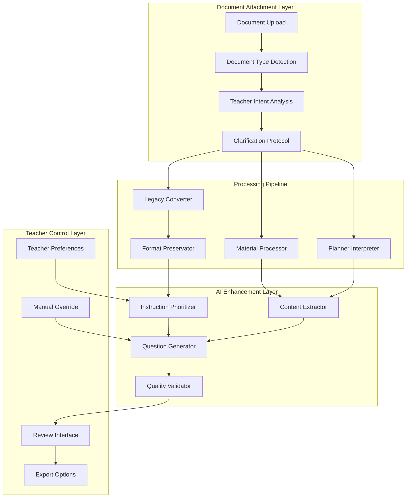

# Document Attachment Implementation Guide for Teacher Use Cases

## Executive Summary

This guide provides a complete implementation strategy for document attachment functionality in the Gabay AI Chatbot/Question Generator system, specifically addressing three critical teacher use cases:

1. **Converting Legacy Questionnaires** - Extract and reformat existing assessments
2. **Processing Learning Materials** - Generate questions from educational resources  
3. **Interpreting Lesson Logs/Planners** - Create aligned assessments from teaching plans

## Current System Analysis

### Existing Capabilities
- ✅ Multi-format document processing (PDF, DOCX, PPTX, TXT, MD)
- ✅ Semantic chunking and vector indexing
- ✅ AI-powered question generation with tool calling
- ✅ Natural language processing for intent detection
- ✅ Real-time progress streaming

### Critical Gaps for Teacher Use Cases
- ❌ No explicit legacy questionnaire detection and conversion
- ❌ Limited document structure preservation for reformatting
- ❌ Missing clarification protocols for ambiguous instructions
- ❌ No teacher instruction prioritization system
- ❌ Insufficient formatting fidelity preservation

## Architecture Overview



## Implementation Phases

### Phase 1: Document Type Detection & Analysis

#### 1.1 Enhanced Document Type Detection
```typescript
export interface DocumentTypeAnalysis {
  documentType: 'legacy_questionnaire' | 'learning_material' | 'lesson_planner' | 'mixed';
  confidence: number;
  detectedFeatures: {
    hasQuestions: boolean;
    hasNumberedItems: boolean;
    hasAnswerKey: boolean;
    hasLessonObjectives: boolean;
    questionPatterns: QuestionPattern[];
  };
  suggestedActions: TeacherAction[];
}
```

#### 1.2 Pattern Recognition for Legacy Questionnaires
- Multiple choice patterns: `/\d+[\.)]\s*.+?\n\s*[aA][\.)].+/`
- True/False patterns: `/\d+[\.)]\s*.+?\s*(True|False|T|F)/i`
- Essay patterns: `/\d+[\.)]\s*.+?\((\d+)\s*points?\)/`
- Fill-in-blank patterns: `/_{3,}|____/`

### Phase 2: Teacher Instruction Processing

#### 2.1 Instruction Prioritization System
```typescript
interface PrioritizationRules {
  priority1_explicit: "Direct teacher commands in current message";
  priority2_context: "Instructions from conversation history";
  priority3_document: "Inferred from document type";
  priority4_defaults: "System default behaviors";
}
```

#### 2.2 Clarification Protocol
When instructions are ambiguous:
1. **Detect ambiguity triggers**
   - Confidence score < 0.7
   - Conflicting instructions detected
   - Missing required parameters

2. **Generate clarification interface**
   ```typescript
   interface ClarificationRequest {
     message: string;
     options: ClarificationOption[];
     quickActions: QuickAction[];
   }
   ```

### Phase 3: Document Processing Pipelines

#### 3.1 Legacy Questionnaire Converter
```typescript
class LegacyQuestionnaireConverter {
  async convert(document: Document, options: ConversionOptions) {
    // 1. Extract questions with original formatting
    const questions = await this.extractQuestions(document);
    
    // 2. Preserve structure and numbering
    const structured = this.preserveStructure(questions, options);
    
    // 3. Convert to online format
    const online = this.convertToOnlineFormat(structured);
    
    // 4. Maintain formatting fidelity
    const formatted = this.applyFormatting(online, options);
    
    return formatted;
  }
}
```

#### 3.2 Learning Material Processor
```typescript
class LearningMaterialProcessor {
  async process(document: Document, instructions: TeacherInstruction) {
    // 1. Extract educational content
    const content = await this.extractContent(document);
    
    // 2. Identify key concepts
    const concepts = this.identifyKeyConcepts(content);
    
    // 3. Generate relevant questions
    const questions = await this.generateQuestions(concepts, instructions);
    
    // 4. Align with learning objectives
    const aligned = this.alignWithObjectives(questions, document.metadata);
    
    return aligned;
  }
}
```

#### 3.3 Lesson Planner Interpreter
```typescript
class LessonPlannerInterpreter {
  async interpret(document: Document) {
    // 1. Extract lesson objectives
    const objectives = this.extractObjectives(document);
    
    // 2. Identify topics and timeline
    const topics = this.extractTopics(document);
    const timeline = this.extractTimeline(document);
    
    // 3. Generate aligned assessments
    const assessments = await this.generateAlignedAssessments(
      objectives,
      topics,
      timeline
    );
    
    return assessments;
  }
}
```

## Frontend Integration

### Enhanced AIAssistantChatEnhanced Component

```typescript
// frontend/src/components/AIAssistantChatEnhanced.tsx

const handleDocumentUpload = async (file: File) => {
  // 1. Analyze document type
  const analysis = await analyzeDocumentType(file);
  
  // 2. Show document analysis to teacher
  showDocumentAnalysis(analysis);
  
  // 3. Get teacher instructions
  const instructions = await getTeacherInstructions();
  
  // 4. Check for clarification needs
  if (needsClarification(instructions)) {
    const clarification = await showClarificationDialog(instructions);
    instructions.merge(clarification);
  }
  
  // 5. Process based on document type and instructions
  const result = await processDocument(file, analysis, instructions);
  
  // 6. Show preview with formatting preserved
  showFormattedPreview(result);
};
```

### Clarification Dialog Component

```typescript
// frontend/src/components/ClarificationDialog.tsx

interface ClarificationDialogProps {
  clarificationRequest: ClarificationRequest;
  onSelection: (selection: ClarificationOption) => void;
}

export const ClarificationDialog: React.FC<ClarificationDialogProps> = ({
  clarificationRequest,
  onSelection
}) => {
  return (
    <Dialog open={true}>
      <DialogContent>
        <DialogHeader>
          <DialogTitle>Help Us Understand Your Request</DialogTitle>
          <DialogDescription>
            {clarificationRequest.message}
          </DialogDescription>
        </DialogHeader>
        
        <div className="grid gap-4">
          {clarificationRequest.options.map(option => (
            <Card 
              key={option.id} 
              className="cursor-pointer hover:bg-accent"
              onClick={() => onSelection(option)}
            >
              <CardHeader>
                <CardTitle className="text-sm">{option.label}</CardTitle>
                <CardDescription>{option.description}</CardDescription>
              </CardHeader>
            </Card>
          ))}
        </div>
        
        <div className="mt-4 flex gap-2">
          {clarificationRequest.quickActions?.map(action => (
            <Button
              key={action.id}
              variant="outline"
              size="sm"
              onClick={() => onSelection(action)}
            >
              {action.label}
            </Button>
          ))}
        </div>
      </DialogContent>
    </Dialog>
  );
};
```

## API Endpoints

### 1. Document Analysis Endpoint
```typescript
POST /api/v2/ai-bot/analyze-document
{
  "documentId": "string",
  "extractedText": "string",
  "userMessage": "string",
  "conversationContext": Message[]
}

Response:
{
  "documentType": "legacy_questionnaire",
  "confidence": 0.92,
  "detectedFeatures": {...},
  "suggestedActions": [...],
  "needsClarification": false
}
```

### 2. Process with Instructions Endpoint
```typescript
POST /api/v2/ai-bot/process-document
{
  "documentId": "string",
  "documentType": "string",
  "instructions": TeacherInstruction[],
  "options": ProcessingOptions
}

Response:
{
  "success": true,
  "processedContent": {...},
  "preservedFormatting": {...},
  "questions": [...],
  "metadata": {...}
}
```

### 3. Clarification Resolution Endpoint
```typescript
POST /api/v2/ai-bot/resolve-clarification
{
  "clarificationId": "string",
  "selection": ClarificationOption,
  "additionalContext": any
}
```

## Quality Assurance

### Format Fidelity Checks
```typescript
interface FormatFidelityMetrics {
  structurePreservation: number;  // 0-100
  numberingAccuracy: number;      // 0-100
  contentIntegrity: number;        // 0-100
  formattingRetention: number;     // 0-100
}
```

### Instruction Compliance Validation
```typescript
interface ComplianceValidation {
  instructionFollowed: boolean;
  deviations: string[];
  confidence: number;
  suggestions: string[];
}
```

## Configuration

### Teacher Preferences
```typescript
interface TeacherPreferences {
  defaultProcessingMode: 'preserve' | 'enhance' | 'convert';
  alwaysRequestClarification: boolean;
  preserveFormattingLevel: 'minimal' | 'moderate' | 'maximum';
  autoDetectDocumentType: boolean;
  questionEnhancement: {
    addExplanations: boolean;
    improveClarity: boolean;
    addMetadata: boolean;
  };
}
```

## Testing Strategy

### Unit Tests
- Document type detection accuracy
- Pattern recognition for question types
- Instruction prioritization logic
- Format preservation algorithms

### Integration Tests
- End-to-end document processing
- Clarification dialog flow
- Teacher instruction compliance
- Multi-format support

### User Acceptance Tests
- Teacher workflow validation
- Format fidelity assessment
- Clarification effectiveness
- Question quality evaluation

## Performance Considerations

### Processing Optimization
- Cache analyzed document patterns
- Batch process similar questions
- Lazy load formatting rules
- Stream large documents

### Scalability
- Queue document processing jobs
- Distribute pattern matching
- Cache conversion templates
- CDN for static resources

## Security & Privacy

### Document Security
- Encrypt documents at rest
- Secure temporary storage
- Clean up processed files
- Audit trail for access

### Teacher Data Protection
- Anonymize student information
- Secure API endpoints
- Rate limiting per user
- Session management

## Monitoring & Analytics

### Key Metrics
```typescript
interface ProcessingMetrics {
  documentTypeAccuracy: number;
  clarificationRate: number;
  conversionSuccessRate: number;
  formatFidelityScore: number;
  teacherSatisfaction: number;
  processingTime: number;
}
```

### Error Tracking
- Document parsing failures
- Pattern recognition errors
- Instruction conflicts
- Format preservation issues

## Rollout Plan

### Phase 1: Beta Testing (Week 1-2)
- Deploy to 10% of teachers
- Focus on legacy questionnaire conversion
- Collect feedback on clarification protocol

### Phase 2: Feature Expansion (Week 3-4)
- Add lesson planner interpretation
- Enhance format preservation
- Improve clarification intelligence

### Phase 3: Full Rollout (Week 5-6)
- Deploy to all users
- Monitor performance metrics
- Iterate based on feedback

## Success Criteria

1. **Conversion Accuracy**: >95% successful legacy questionnaire conversions
2. **Format Fidelity**: >90% preservation of original formatting
3. **Clarification Effectiveness**: <20% clarification requests needed
4. **Teacher Satisfaction**: >4.5/5 rating
5. **Processing Speed**: <30 seconds for average document

## Conclusion

This implementation guide provides a comprehensive approach to adding document attachment functionality that specifically addresses teacher needs for:

1. Converting legacy questionnaires while preserving format
2. Processing learning materials to generate relevant questions
3. Interpreting lesson planners to create aligned assessments

The solution balances automation with teacher control through:
- Intelligent document type detection
- Clear clarification protocols
- Explicit instruction prioritization
- Format fidelity preservation
- Comprehensive quality assurance

By following this implementation plan, the Gabay AI system will provide teachers with a powerful, intuitive tool for transforming their existing educational materials into interactive online assessments while maintaining their specific requirements and preferences.
