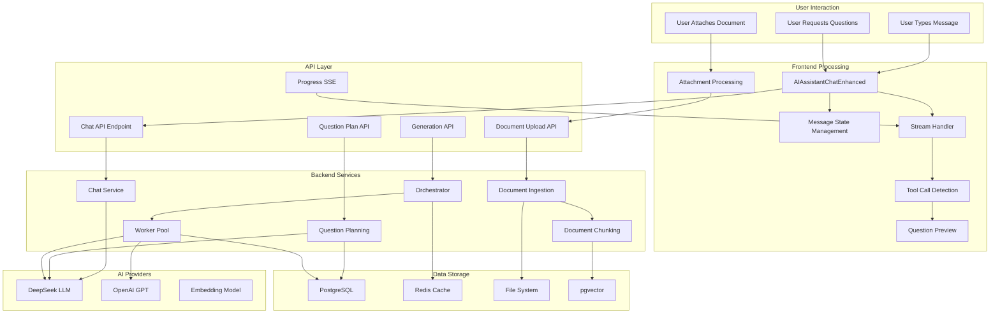
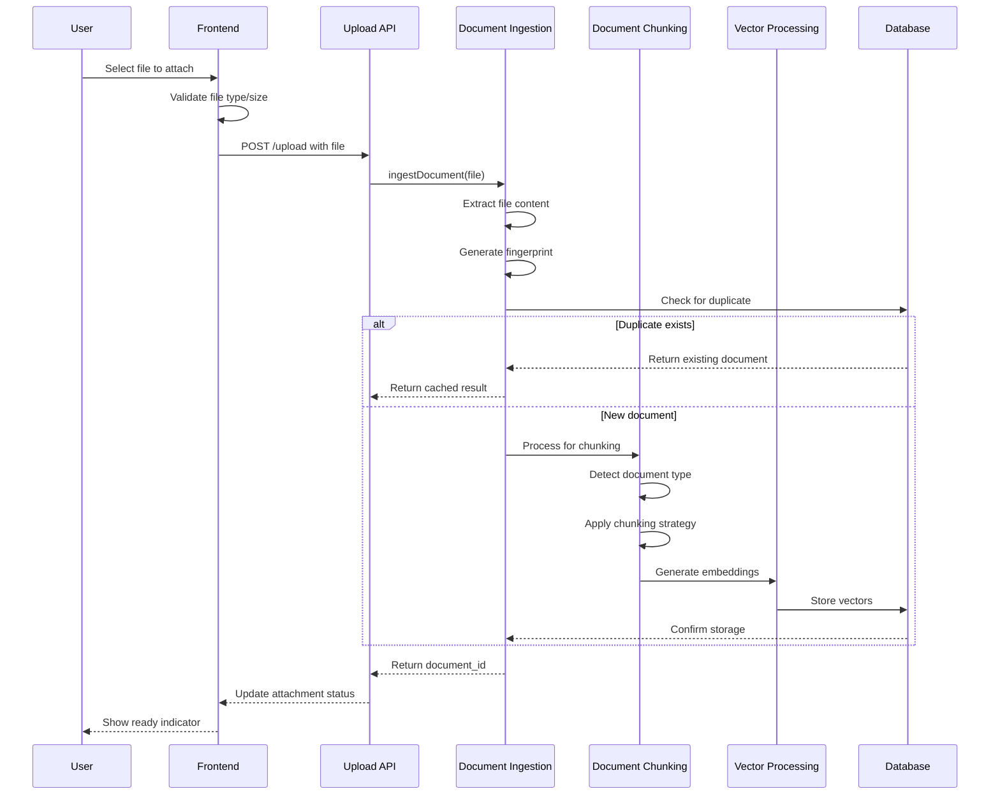
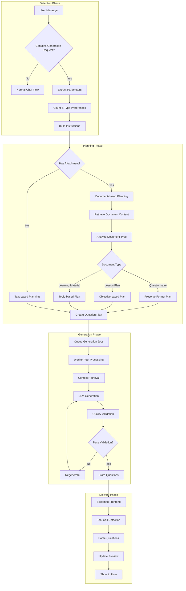
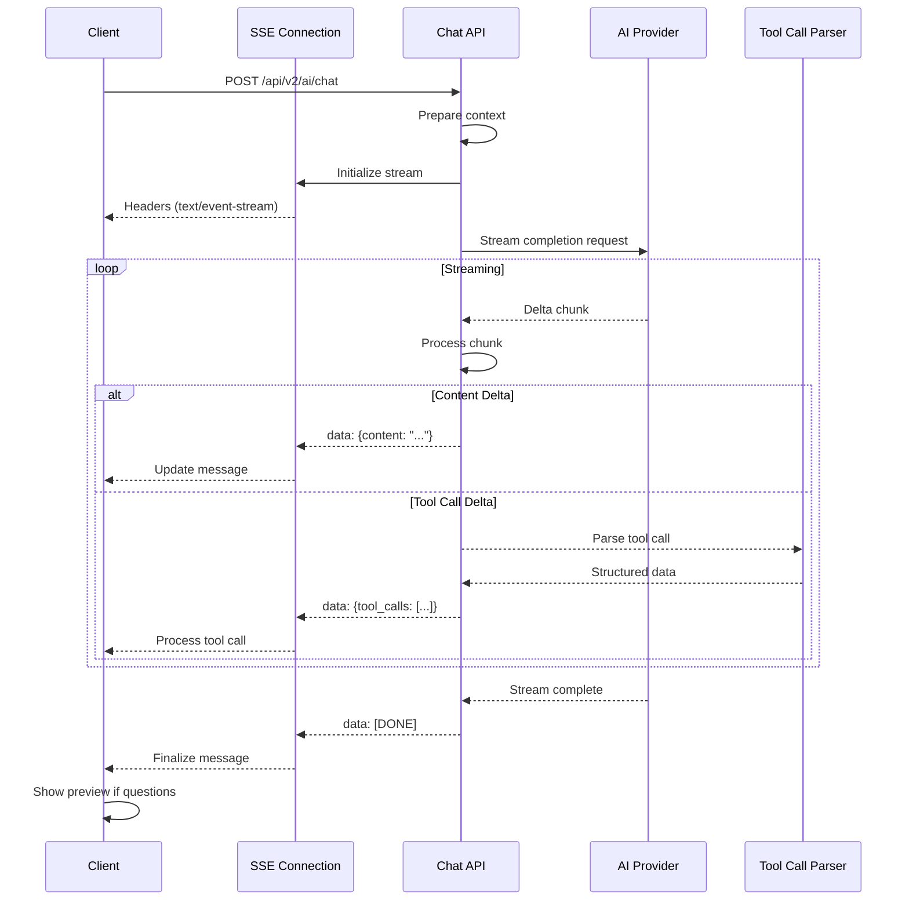
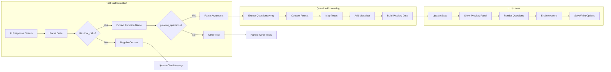
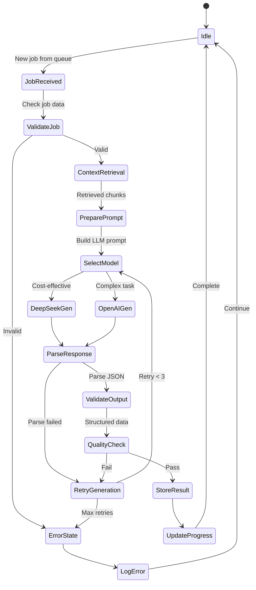
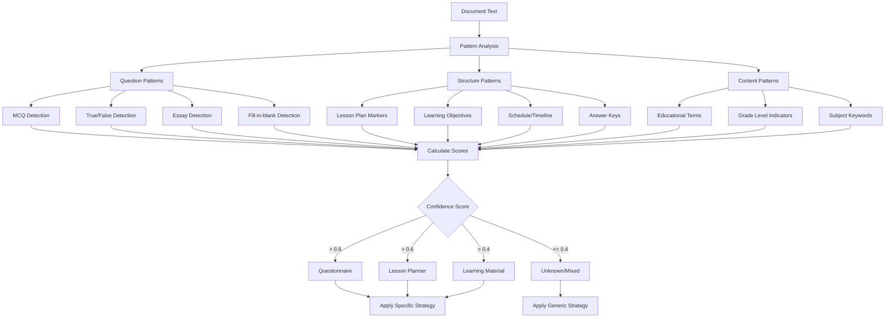
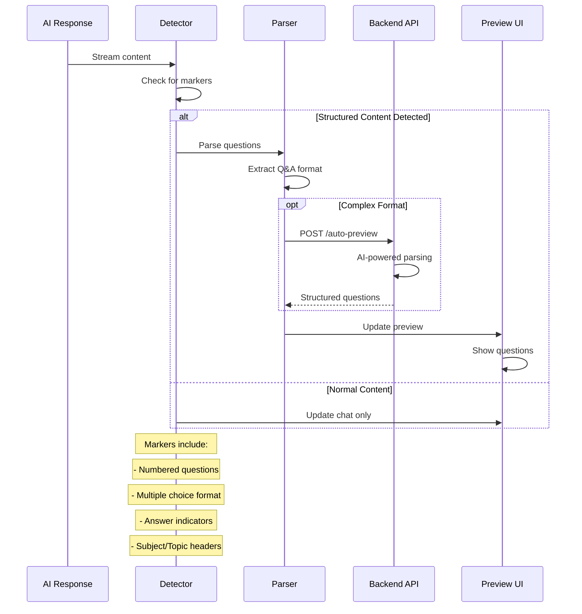
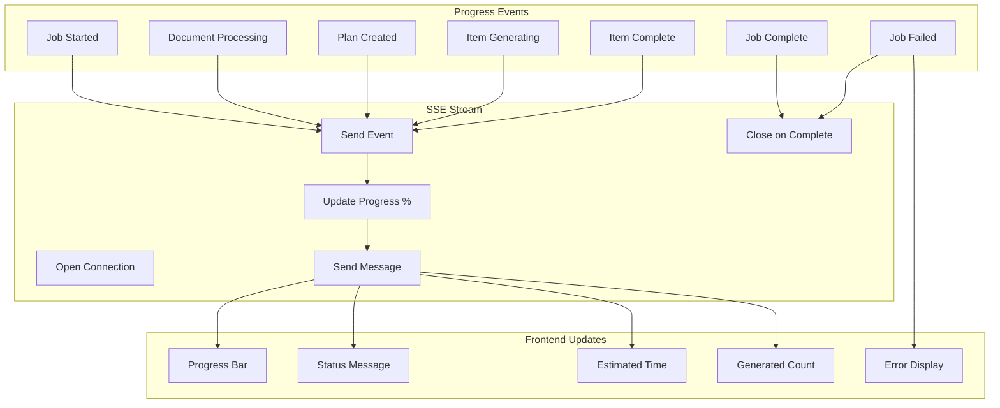
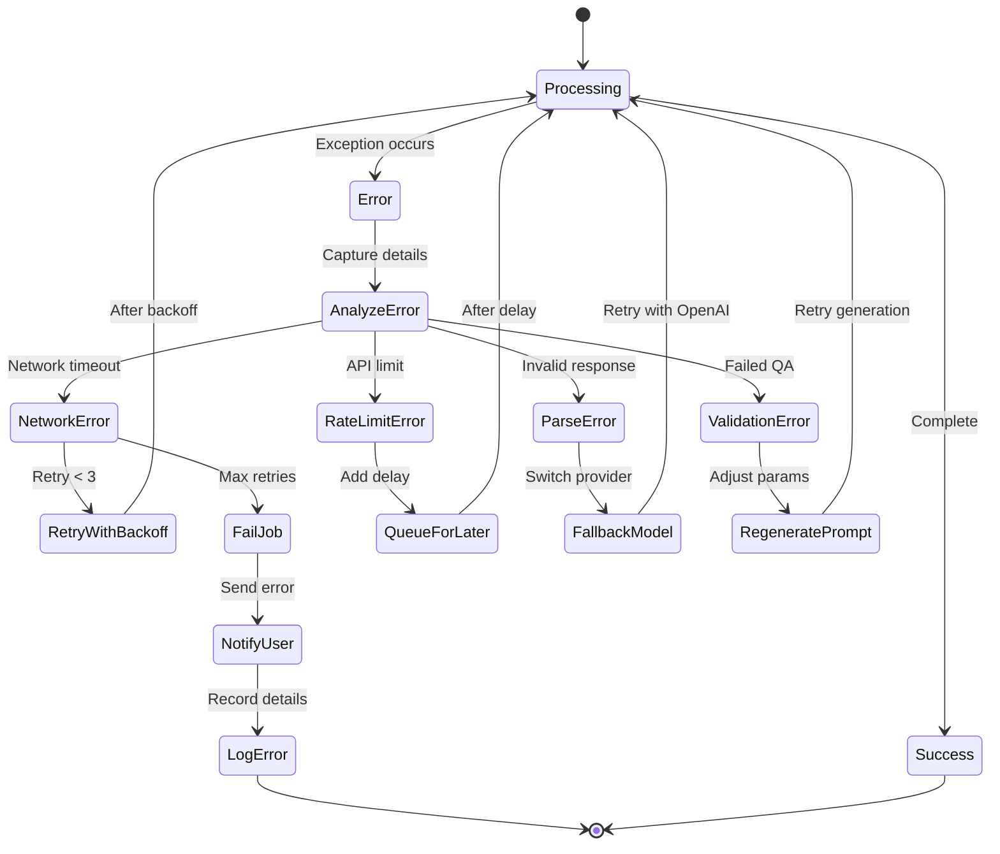

# Gabay AI Chatbot - Detailed Flow Diagrams

## 1. Complete System Flow

## 2. Document Attachment Flow

## 3. Question Generation from Chat

## 4. Real-time Streaming Flow

## 5. Question Preview & Tool Call Flow

## 6. Worker Pool Processing

## 7. Document Type Detection Flow

## 8. Auto-Preview Detection Flow

## 9. Progress Tracking Flow

## 10. Error Recovery Flow

---

**Note:** These flow diagrams represent the actual implementation as found in the codebase. The system uses a hybrid approach combining real-time chat capabilities with asynchronous question generation processing, optimized for educational assessment creation.

**Last Updated:** January 26, 2025
