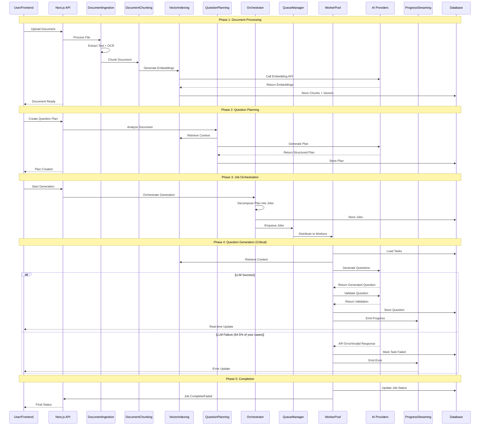

# Question Generator Service Architecture - Deep Dive

## Service Dependency Map

This document provides a detailed breakdown of all services, their dependencies, and how they interact in the question generation workflow.

---

## Core Service Hierarchy

### Level 1: Foundation Services

#### **1. Database Services**
- **Primary**: PostgreSQL with pgvector extension
- **Cache**: Redis for job queues and caching
- **ORM**: Prisma Client with tenant-aware connections

```typescript
// Critical Database Models
- DocumentIndex      // Document metadata and processing status
- DocumentChunk      // Text chunks with vector embeddings  
- QuestionPlan       // AI-generated question generation plans
- GenerationJob      // Batch processing jobs with status
- QuestionGenerationTask // Individual question generation tasks
- QuestionItem       // Final generated questions with validation
- ProcessingProgress // Real-time progress tracking
```

#### **2. External AI Services**
- **DeepSeek API**: Primary cost-effective LLM provider
- **OpenAI API**: Premium validation and fallback provider
- **Embedding Models**: Vector generation for semantic search

---

### Level 2: Core Processing Services

#### **DocumentIngestionService**
**File**: `services/document-ingestion.service.ts`
**Purpose**: Multi-format document processing and text extraction

**Dependencies**:
- File system for document storage
- pdf-parse for PDF text extraction
- mammoth for DOCX processing
- tesseract.js for OCR fallback
- crypto for content fingerprinting

**Key Methods**:
```typescript
async ingestDocument(file: File, userId: string, options?: IngestionOptions): Promise<IngestionResult>
async validateFile(file: File, options: IngestionOptions): Promise<ValidationResult>
async extractText(filePath: string, mimeType: string, options: IngestionOptions): Promise<ExtractionResult>
```

**Data Flow**:
```
File Upload → Validation → Storage → Text Extraction → OCR Fallback → Fingerprinting → Database Storage
```

#### **DocumentChunkingService**
**File**: `services/document-chunking.service.ts`
**Purpose**: Semantic text chunking with structure preservation

**Dependencies**:
- DocumentIngestionService (for extracted text)
- Token counting utilities
- Section detection algorithms

**Key Methods**:
```typescript
async chunkDocument(documentId: string, extractedText: string, options?: ChunkingOptions): Promise<ChunkingResult>
private detectDocumentSections(text: string): DocumentSection[]
private chunkSection(documentId: string, section: DocumentSection, startIndex: number): Promise<DocumentChunk[]>
```

**Chunking Algorithm**:
1. **Section Detection**: Identify headings (H1-H6, numbered, roman numerals)
2. **Token-Aware Splitting**: 700-1200 token chunks with 80-120 overlap
3. **Structure Preservation**: Maintain page ranges, section paths, keywords
4. **Metadata Enrichment**: Add heading context, chunk types, keywords

#### **VectorIndexingService**
**File**: `services/vector-indexing.service.ts`
**Purpose**: Generate and store vector embeddings for semantic search

**Dependencies**:
- DocumentChunkingService (for text chunks)
- DeepSeek/OpenAI APIs (for embedding generation)
- pgvector extension (for vector storage)

**Key Methods**:
```typescript
async indexDocument(documentId: string, options?: VectorIndexingOptions): Promise<IndexingResult>
async searchRelevantChunks(query: RetrievalQuery, options?: SearchOptions): Promise<RetrievalResult>
async generateEmbedding(text: string): Promise<number[]>
```

**Vector Processing**:
1. **Batch Embedding**: Process chunks in batches for efficiency
2. **Caching Strategy**: Store embeddings to reduce API costs
3. **Similarity Search**: Use cosine similarity for context retrieval
4. **Cost Optimization**: Prefer DeepSeek ($0.02/M tokens) over OpenAI ($0.13/M tokens)

---

### Level 3: AI Planning & Generation Services

#### **QuestionPlanningService**
**File**: `services/question-planning.service.ts`
**Purpose**: AI-powered analysis and question generation planning

**Dependencies**:
- VectorIndexingService (for document context)
- DeepSeek/OpenAI APIs (for document analysis)
- DocumentChunkingService (for content access)

**Key Methods**:
```typescript
async createQuestionPlan(documentId: string, userRequest: PlanRequest, options?: PlanningOptions): Promise<PlanResult>
private async analyzeDocument(documentId: string, userRequest: PlanRequest): Promise<DocumentAnalysis>
private async generatePlanWithLLM(analysis: DocumentAnalysis, userRequest: PlanRequest): Promise<string>
```

**Planning Process**:
1. **Document Analysis**: Extract topics, assess complexity, identify key concepts
2. **LLM Planning**: Generate structured question distribution using AI
3. **Plan Validation**: Ensure plan meets user requirements and constraints
4. **Database Storage**: Store structured QuestionPlan for execution

#### **QuestionGenerationOrchestrator**
**File**: `services/question-generation-orchestrator.service.ts`
**Purpose**: Decompose plans into executable jobs and coordinate execution

**Dependencies**:
- QuestionPlanningService (for question plans)
- QuestionGenerationQueueManager (for job distribution)
- Database services (for job tracking)

**Key Methods**:
```typescript
async orchestrateGeneration(planId: string, options?: OrchestrationOptions): Promise<OrchestrationResult>
private async createJobsFromPlan(plan: QuestionPlan, planId: string): Promise<JobData[]>
private async enqueueJobs(jobs: any[], options: any, docId: string, tenantTag: string): Promise<any[]>
```

**Orchestration Flow**:
1. **Plan Decomposition**: Break plans into batched jobs by question type
2. **Job Creation**: Create database records for tracking
3. **Queue Distribution**: Enqueue jobs to Redis via BullMQ
4. **Progress Monitoring**: Track job status and emit progress events

---

### Level 4: Job Processing & Worker Services

#### **QuestionGenerationQueueManager**
**File**: `services/question-generation-queue.service.ts`
**Purpose**: Redis-based job queue management with BullMQ

**Dependencies**:
- Redis server
- BullMQ library
- Worker pool services

**Key Features**:
- **Job Types**: mcq_batch, tf_batch, essay_batch, mixed_batch
- **Priority Management**: Higher priority for simpler question types
- **Retry Logic**: Exponential backoff with configurable limits
- **Dead Letter Queue**: Failed jobs for manual review

#### **WorkerManager**
**File**: `services/worker-manager.service.ts`
**Purpose**: Lifecycle management for question generation workers

**Dependencies**:
- QuestionGenerationQueueManager
- QuestionGenerationWorkerPool
- Health monitoring systems

**Key Methods**:
```typescript
async initialize(): Promise<void>
async start(): Promise<void>
async stop(): Promise<void>
private async performHealthCheck(): Promise<void>
```

**Health Monitoring**:
- **Failure Rate Tracking**: Monitor job success/failure ratios
- **Automatic Restart**: Restart workers on high failure rates
- **Status Reporting**: Provide real-time worker health status

#### **QuestionGenerationWorkerPool** ⚠️ **CRITICAL COMPONENT**
**File**: `services/question-generation-worker-pool.service.ts`
**Purpose**: Parallel question generation with LLM providers

**Dependencies**:
- VectorIndexingService (for context retrieval)
- DeepSeek/OpenAI APIs (for question generation)
- Database services (for result storage)

**Worker Processing Pipeline**:
```typescript
// Main processing method
private async processGenerationJob(job: Job): Promise<any> {
  // 1. Load tasks from database
  const dbTasks = await prisma.questionGenerationTask.findMany({ where: { jobId } });
  
  // 2. Process each task
  for (const task of dbTasks) {
    // 2a. Retrieve relevant context
    const context = await this.retrieveContext(task, metadata.documentId, tenantTag);
    
    // 2b. Generate question using LLM
    const generatedQuestion = await this.generateQuestion(task, context);
    
    // 2c. Validate question quality
    const validation = await this.validateQuestion(generatedQuestion, context, 'draft');
    
    // 2d. Store successful questions
    if (validation.is_valid) {
      const questionItem = await this.storeQuestionItem(task, generatedQuestion, context, validation, planId, tenantTag);
      results.push(questionItem);
    }
  }
  
  // 3. Determine job success/failure
  const successRate = results.length / totalTasks;
  const jobStatus = successRate >= 0.5 && results.length > 0 ? 'completed' : 'failed';
  
  return { success: jobStatus === 'completed', results };
}
```

**LLM Provider Configuration**:
```typescript
// Current Issue: Hard-coded to OpenAI
const defaultConfig: WorkerConfig = {
  providers: {
    draft: new OpenAIQuestionProvider(),      // ⚠️ May lack API key
    validation: new OpenAIQuestionProvider()  // ⚠️ May lack API key
  }
};

// Fixed Implementation: Intelligent provider selection
const hasDeepSeekKey = !!process.env.DEEPSEEK_API_KEY;
const hasOpenAIKey = !!process.env.OPENAI_API_KEY;

const draftProvider = hasDeepSeekKey ? new DeepSeekQuestionProvider() : new OpenAIQuestionProvider();
const validationProvider = hasOpenAIKey ? new OpenAIQuestionProvider() : new DeepSeekQuestionProvider();
```

---

### Level 5: Communication & Streaming Services

#### **StreamingProgressService**
**File**: `services/streaming-progress.service.ts`
**Purpose**: Real-time progress updates via SSE/WebSocket

**Dependencies**:
- HTTP server for SSE connections
- WebSocket server for bidirectional communication
- Event emitter for progress broadcasting

**Key Features**:
```typescript
// SSE subscription management
subscribeSSE(subscriberId: string, response: any, options: ProgressStreamOptions): void
broadcastProgress(progress: ProcessingProgress): void
getStats(): StreamingStats

// Current Issue: 0 subscribers detected
[StreamingProgress] Broadcasting to 0 subscribers for plan cmfhkdezn87slzb0byprgspui
```

**Progress Event Types**:
- `plan_created` - Question plan generated
- `job_started` - Generation job started
- `item_retrieving` - Context retrieval in progress
- `item_generating` - Question generation in progress
- `item_validating` - Question validation in progress
- `item_completed` - Individual question completed
- `job_completed` - Generation job completed
- `plan_completed` - All questions generated

#### **ProgressEmissionUtil**
**File**: `services/progress-emission.util.ts`
**Purpose**: Centralized progress event emission and persistence

**Key Methods**:
```typescript
static async emitProgress(progress: Partial<ProcessingProgress>, onProgress?: Function): Promise<void>
static async emitJobStarted(planId: string, message: string, metadata?: any): Promise<void>
static async emitJobCompleted(planId: string, message: string, progressPercentage?: number): Promise<void>
```

---

## Data Flow Analysis

### Complete Generation Workflow



---

## Critical Failure Points Analysis

### 1. **LLM Provider Authentication** ⚠️ **PRIMARY ISSUE**

**Current Problem**: Worker pool defaults to OpenAI providers regardless of API key availability

**Code Location**: `createWorkerPool()` function in `question-generation-worker-pool.service.ts`

**Impact**: 64.5% failure rate suggests most workers fail due to missing/invalid API keys

**Fix Applied**: Intelligent provider selection based on available API keys

### 2. **Progress Streaming Disconnect** ⚠️ **SECONDARY ISSUE**

**Current Problem**: Frontend not properly connecting to SSE stream

**Evidence**: `[StreamingProgress] Broadcasting to 0 subscribers`

**Impact**: UI shows completion regardless of actual job status

**Root Cause**: SSE connection not established or maintained properly

### 3. **Job Success Criteria** ⚠️ **MASKING ISSUE**

**Current Problem**: Jobs report "completed" even with 0 successful questions

**Code Location**: Job completion logic in worker processing

**Impact**: False positive completion status

**Fix Applied**: Proper success rate calculation and failure propagation

---

## Service Configuration Matrix

| Service | Dependencies | API Keys Required | Database Tables | Critical for Generation |
|---------|-------------|-------------------|-----------------|------------------------|
| **DocumentIngestion** | File system, OCR tools | None | DocumentIndex | ✅ Required |
| **DocumentChunking** | DocumentIngestion | None | DocumentChunk | ✅ Required |
| **VectorIndexing** | DocumentChunking | DeepSeek/OpenAI | DocumentChunk (embeddings) | ✅ Required |
| **QuestionPlanning** | VectorIndexing | DeepSeek/OpenAI | QuestionPlan | ✅ Required |
| **Orchestrator** | QuestionPlanning | None | GenerationJob, QuestionGenerationTask | ✅ Required |
| **QueueManager** | Redis | None | None (Redis storage) | ✅ Required |
| **WorkerPool** | All above + LLM APIs | **DeepSeek/OpenAI** | QuestionItem | ⚠️ **CRITICAL** |
| **ProgressStreaming** | None | None | ProcessingProgress | Optional (UX) |

---

## Debugging Service Dependencies

### Check Service Health Chain

```bash
# 1. Database connectivity
npx prisma studio

# 2. Document processing
curl -X POST http://localhost:3000/api/v2/question-generator/upload -F "document=@test.txt"

# 3. Vector indexing  
# (Check if chunks have embeddings in database)
SELECT COUNT(*) FROM "DocumentChunk" WHERE embedding IS NOT NULL AND array_length(embedding, 1) > 0;

# 4. Question planning
curl -X POST http://localhost:3000/api/v2/question-generator/create-plan -H "Content-Type: application/json" -d '{"documentId":"doc_id","questionTypes":{"mcq":{"count":1}}}'

# 5. Worker pool status
curl http://localhost:3000/api/v2/question-generator/workers/status

# 6. LLM provider test
curl -H "Authorization: Bearer $DEEPSEEK_API_KEY" https://api.deepseek.com/v1/models
```

Each step must succeed before the next can work properly.

---

## Production Deployment Considerations

### Service Scaling Strategy

1. **Stateless Services**: All processing services are stateless and can be horizontally scaled
2. **Database Scaling**: Use read replicas for analytics, partitioning for large datasets
3. **Redis Scaling**: Use Redis Cluster for high-throughput job processing
4. **Worker Scaling**: Scale worker concurrency based on LLM API rate limits

### Monitoring & Alerting

```typescript
// Key metrics to monitor
interface ServiceMetrics {
  documentProcessing: {
    uploadSuccessRate: number;
    averageProcessingTime: number;
    ocrFallbackRate: number;
  };
  questionGeneration: {
    jobSuccessRate: number;        // Currently 35.5% (need >90%)
    averageQuestionsPerJob: number; // Currently 0 (need >0)
    llmProviderLatency: number;
    validationPassRate: number;
  };
  systemHealth: {
    workerUtilization: number;
    queueDepth: number;
    progressStreamSubscribers: number; // Currently 0 (need >0)
  };
}
```

This comprehensive service architecture analysis should help you understand exactly where the question generation is failing in your system. The primary focus should be on fixing the LLM provider configuration in the WorkerPool service.