# Gabay AI Chat System - Diagrams & Flow Charts

> **Version:** 3.0.0 | **Last Updated:** 2025-01-30

## 📊 System Architecture Diagrams

### 1. Complete System Architecture

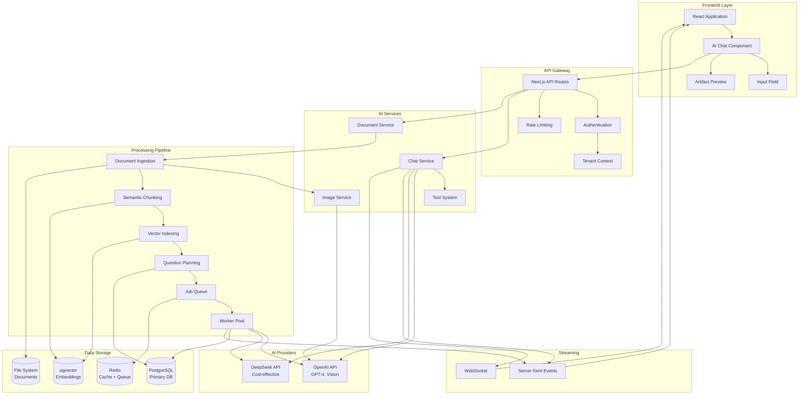

### 2. Frontend Component Architecture

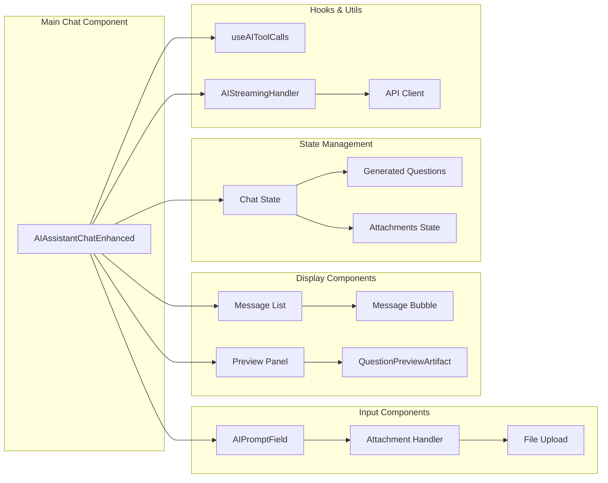

### 3. Backend Service Architecture

```mermaid
graph TB
    subgraph "API Endpoints"
        CHAT_API[/api/v2/ai/chat]
        UPLOAD_API[/api/v2/question-generator/upload-document]
        PLAN_API[/api/v2/question-generator/create-plan]
        GEN_API[/api/v2/question-generator/start-generation]
        STATUS_API[/api/v2/question-generator/status/[planId]]
    end
    
    subgraph "Core Services"
        INGEST[DocumentIngestionService]
        CHUNK[DocumentChunkingService]
        VECTOR[VectorIndexingService]
        PLANNING[QuestionPlanningService]
        ORCHESTRATOR[OrchestrationService]
        QUEUE_MGR[QueueManagerService]
        WORKER_POOL[WorkerPoolService]
        VALIDATION[ValidationService]
    end
    
    subgraph "External Services"
        OPENAI_SVC[OpenAI Service]
        DEEPSEEK_SVC[DeepSeek Service]
        VISION_SVC[Vision Service]
        OCR_SVC[OCR Service]
    end
    
    CHAT_API --> OPENAI_SVC
    CHAT_API --> DEEPSEEK_SVC
    
    UPLOAD_API --> INGEST
    INGEST --> VISION_SVC
    INGEST --> OCR_SVC
    INGEST --> CHUNK
    
    CHUNK --> VECTOR
    VECTOR --> OPENAI_SVC
    VECTOR --> DEEPSEEK_SVC
    
    PLAN_API --> PLANNING
    PLANNING --> VECTOR
    PLANNING --> OPENAI_SVC
    
    GEN_API --> ORCHESTRATOR
    ORCHESTRATOR --> QUEUE_MGR
    QUEUE_MGR --> WORKER_POOL
    
    WORKER_POOL --> VECTOR
    WORKER_POOL --> OPENAI_SVC
    WORKER_POOL --> DEEPSEEK_SVC
    WORKER_POOL --> VALIDATION
    
    STATUS_API --> WORKER_POOL
```

## 🔄 Data Flow Diagrams

### 4. Complete User Journey

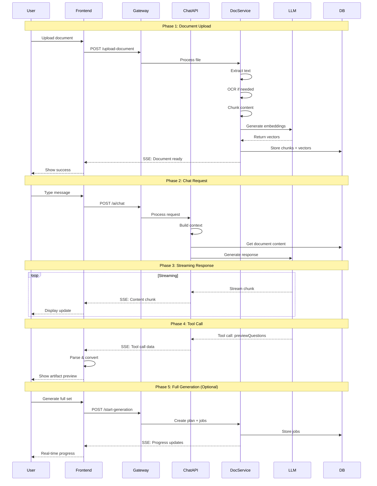

### 5. Document Processing Flow

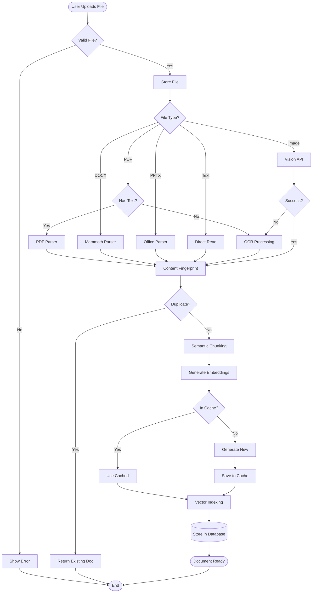

### 6. Tool Call Processing Flow

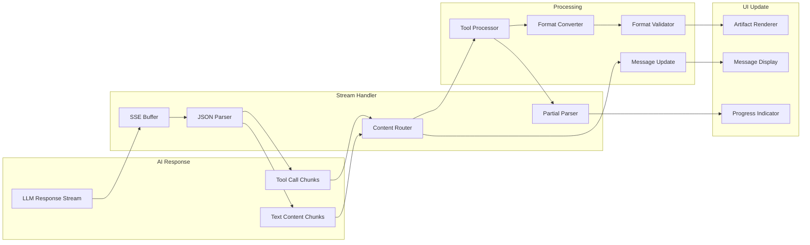

### 7. Question Generation Pipeline

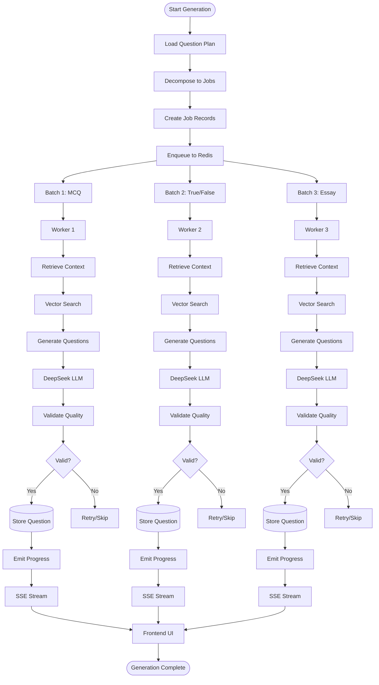

## 🔀 State Diagrams

### 8. Document State Machine

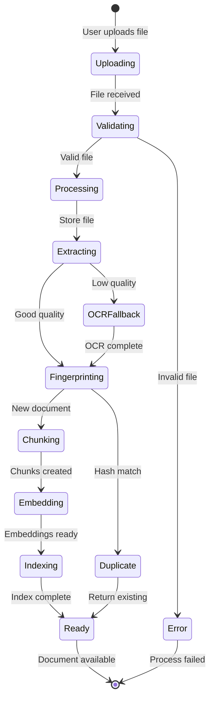

### 9. Question Generation State Machine

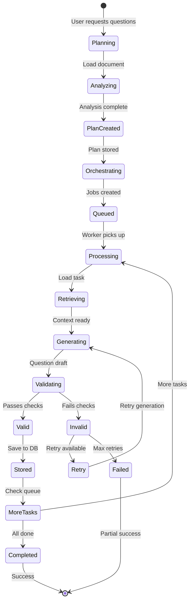

## 📈 Deployment Architecture

### 10. Production Deployment

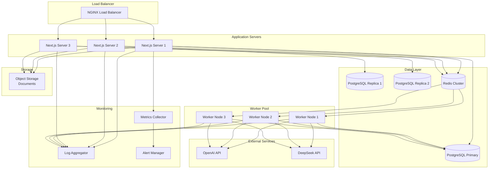

### 11. Data Persistence Layer

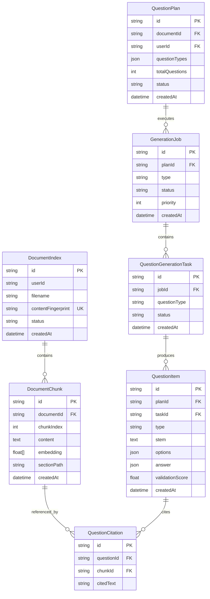

## 🎯 Integration Patterns

### 12. Frontend-Backend Integration

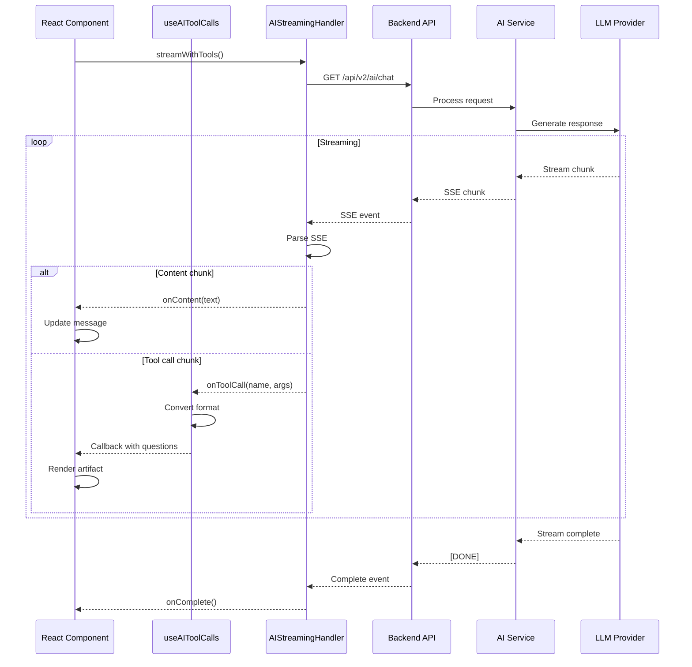

---

**Document Version:** 3.0.0  
**Last Updated:** 2025-01-30  
**Format:** Mermaid Diagrams
