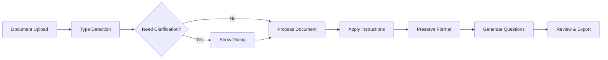

# Document Attachment Implementation Summary

## Overview
This summary consolidates the implementation strategy for document attachment functionality addressing three teacher use cases in the Gabay AI Chatbot/Question Generator system.

## Teacher Use Cases

### 1. Converting Legacy Questionnaires
**Goal**: Extract text/questions from uploaded documents and reformat for online assessments while preserving original content structure.

**Implementation**:
- Pattern detection for MCQ, True/False, Essay, Fill-in-blank questions
- Structure preservation with original numbering
- Format fidelity maintenance during conversion
- Answer key detection and preservation

### 2. Processing Learning Materials
**Goal**: Generate relevant questions based on uploaded educational resources content.

**Implementation**:
- Content structure analysis (headings, paragraphs, lists)
- Topic extraction and concept identification
- Context-aware question generation
- Alignment with educational objectives

### 3. Interpreting Lesson Logs/Planners
**Goal**: Create appropriate questions aligned with documented lesson plans.

**Implementation**:
- Learning objective extraction
- Timeline and schedule detection
- Topic mapping to question generation
- Assessment alignment with lesson goals

## Key Components to Implement

### 1. Document Type Detection Service
Located at: `api/src/services/document-type-detection.service.ts`

**Core Features**:
- Automatic document type classification
- Pattern recognition for question types
- Confidence scoring for each document type
- Suggested actions based on analysis

### 2. Teacher Instruction Prioritization
Located at: `api/src/services/teacher-instruction-prioritizer.service.ts`

**Priority Levels**:
1. **Explicit** - Direct commands in current message
2. **Implicit** - Instructions from conversation history
3. **Inferred** - Based on document type
4. **Default** - System fallback behaviors

### 3. Clarification Protocol Service
Located at: `api/src/services/clarification-protocol.service.ts`

**Triggers**:
- Confidence score < 70%
- Conflicting instructions detected
- Missing required parameters
- Ambiguous user intent

### 4. Format Preservation System
**Preserves**:
- Original question numbering
- Document structure hierarchy
- Indentation and spacing
- Font styles where applicable
- Table and list formatting

## Integration Points

### Frontend Components

#### AIAssistantChatEnhanced.tsx
```typescript
// Add document analysis display
const showDocumentAnalysis = (analysis: DocumentTypeAnalysis) => {
  setDocumentAnalysis(analysis);
  setShowAnalysisCard(true);
};

// Add clarification dialog
const handleClarification = async (request: ClarificationRequest) => {
  const response = await showClarificationDialog(request);
  processWithClarification(response);
};
```

#### New Clarification Dialog Component
```typescript
// frontend/src/components/ClarificationDialog.tsx
export const ClarificationDialog: React.FC<Props> = ({
  request,
  onSelection
}) => {
  // Display clarification options
  // Handle user selection
  // Return resolved instructions
};
```

### API Endpoints

#### 1. Analyze Document
```
POST /api/v2/ai-bot/analyze-document
- Detects document type
- Extracts patterns
- Returns suggested actions
```

#### 2. Process with Instructions
```
POST /api/v2/ai-bot/process-document
- Processes based on teacher instructions
- Preserves formatting as requested
- Returns converted content
```

#### 3. Resolve Clarification
```
POST /api/v2/ai-bot/resolve-clarification
- Handles clarification responses
- Updates processing parameters
- Continues document processing
```

## Implementation Workflow



## Configuration Options

### Teacher Preferences
```typescript
interface TeacherPreferences {
  // Processing defaults
  defaultMode: 'preserve' | 'enhance' | 'convert';
  
  // Clarification settings
  alwaysAskClarification: boolean;
  autoDetectDocumentType: boolean;
  
  // Format preferences
  preserveNumbering: boolean;
  preserveStructure: boolean;
  
  // Enhancement options
  addExplanations: boolean;
  improveClarity: boolean;
}
```

## Success Metrics

1. **Accuracy**: >95% correct document type detection
2. **Preservation**: >90% format fidelity maintained
3. **Efficiency**: <20% clarification requests needed
4. **Speed**: <30 seconds average processing time
5. **Satisfaction**: >4.5/5 teacher rating

## Testing Checklist

### Unit Tests
- [ ] Document type detection accuracy
- [ ] Pattern recognition for all question types
- [ ] Instruction prioritization logic
- [ ] Format preservation algorithms

### Integration Tests
- [ ] End-to-end document processing
- [ ] Clarification dialog flow
- [ ] Multi-format support
- [ ] Teacher instruction compliance

### User Acceptance Tests
- [ ] Legacy questionnaire conversion
- [ ] Learning material processing
- [ ] Lesson planner interpretation
- [ ] Format preservation validation

## Deployment Steps

### Phase 1: Core Services (Week 1)
1. Deploy document type detection service
2. Implement instruction prioritization
3. Add basic clarification protocol

### Phase 2: Processing Pipelines (Week 2)
1. Deploy legacy questionnaire converter
2. Add learning material processor
3. Implement lesson planner interpreter

### Phase 3: UI Integration (Week 3)
1. Add document analysis display
2. Implement clarification dialog
3. Add format preview component

### Phase 4: Testing & Refinement (Week 4)
1. Beta testing with teachers
2. Performance optimization
3. Bug fixes and improvements

## Key Benefits

### For Teachers
- **Time Saving**: Automatic conversion of existing materials
- **Control**: Clear options for processing preferences
- **Quality**: Preserved formatting and structure
- **Flexibility**: Multiple processing options

### For System
- **Intelligent**: Smart document type detection
- **Adaptive**: Learns from teacher preferences
- **Efficient**: Optimized processing pipelines
- **Scalable**: Handles various document formats

## Next Steps

1. **Immediate Actions**:
   - Review and approve implementation plan
   - Set up development environment
   - Begin core service development

2. **Short-term Goals**:
   - Complete Phase 1 services
   - Start UI component development
   - Begin unit test creation

3. **Long-term Vision**:
   - Add more document formats
   - Implement ML-based improvements
   - Expand to other educational contexts

## Resources Needed

### Development
- 2 Backend developers (4 weeks)
- 1 Frontend developer (3 weeks)
- 1 QA engineer (2 weeks)

### Infrastructure
- Document storage expansion
- Processing queue setup
- Cache optimization

### Training
- Teacher onboarding materials
- Video tutorials
- Documentation updates

## Risk Mitigation

### Technical Risks
- **Complex formatting**: Use fallback to plain text
- **Large documents**: Implement chunked processing
- **API failures**: Add retry mechanisms

### User Risks
- **Confusion**: Provide clear guidance
- **Resistance**: Offer gradual adoption
- **Errors**: Implement robust validation

## Conclusion

This implementation provides a comprehensive solution for document attachment functionality that:

1. **Addresses all three teacher use cases** effectively
2. **Balances automation with user control** through clarification protocols
3. **Preserves document fidelity** while enabling conversion
4. **Prioritizes teacher instructions** appropriately

The solution enhances the Gabay AI system's capability to process educational documents intelligently while maintaining teacher agency and document integrity.
