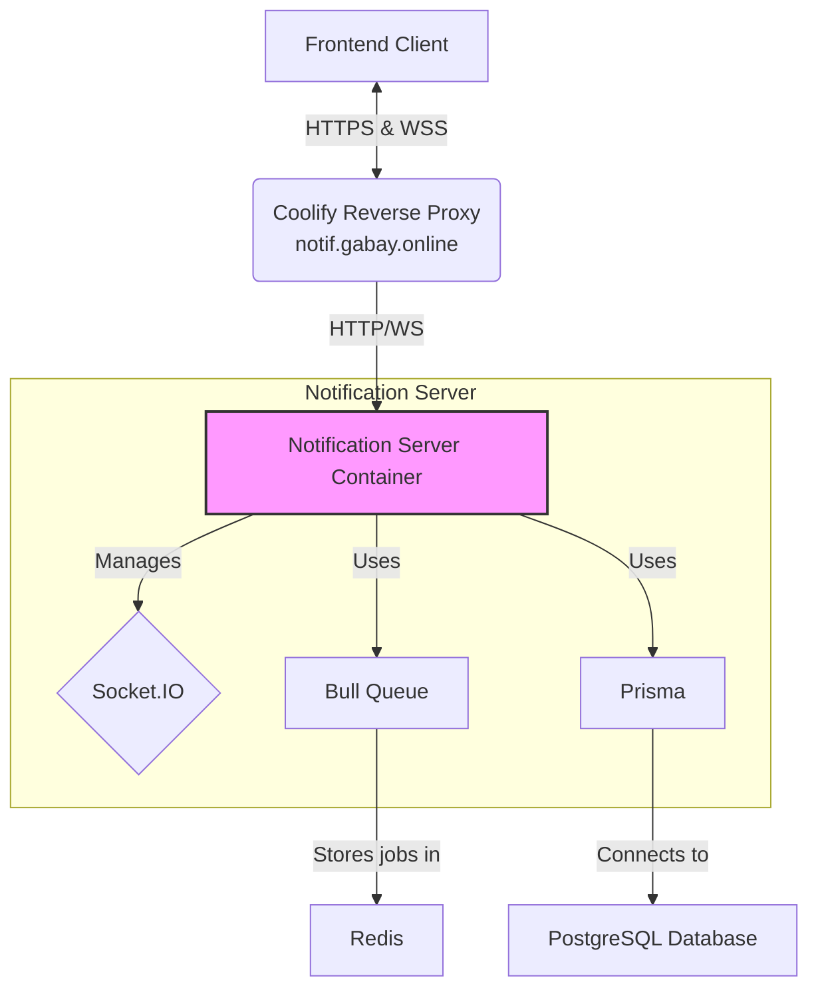

# Gabay Notification Engine - Technical Documentation

## Architecture Overview

The Gabay Notification Engine is a standalone, multi-tenant service responsible for real-time notification delivery.

### System Components



### Tech Stack
- **Real-time Server**: Node.js, Express, Socket.IO
- **Frontend**: Next.js, React, `NotificationContext`
- **Database**: PostgreSQL with Prisma ORM
- **Queue & Cache**: Bull with Redis for queueing and caching pending notifications.
- **Deployment**: Coolify with Traefik as the reverse proxy.

## Core Flow

1.  **Initiation**: An action in the main application (e.g., a new submission) triggers a request to create a notification.
2.  **Queueing**: The notification is created in the PostgreSQL database with a `PENDING` status and a job is added to the Bull queue in Redis.
3.  **Processing**: The `notification-server.js` worker picks up the job from the queue.
4.  **Delivery Check**: The worker checks if the target user has an active WebSocket connection.
    - **If Online**: The notification is sent directly to the user via their unique WebSocket room (`<tenantId>:<userId>`). The database record is updated to `SENT`.
    - **If Offline**: The notification is stored in a Redis list (`user:pending:<tenantId>:<userId>`) for later delivery.
5.  **Client Connection**: When a user logs into the frontend, the `NotificationProvider` initializes.
    - It makes a one-time API call to `GET /api/notifications/user` to fetch historical and pending notifications.
    - It establishes a persistent WebSocket connection via the `NotificationService`.
6.  **Pending Delivery**: Upon successful connection, the server checks the Redis pending list for that user and immediately sends any stored notifications.

## Database Schema

*The schema below is an accurate representation of the core notification tables.*

#### ScheduledNotification
*This table holds the master record for a notification event.*
```prisma
model ScheduledNotification {
  id            String   @id @default(cuid())
  templateId    String
  // ... other fields from your actual schema
  status        String   // PENDING, SENT, FAILED, ERROR
  scheduledAt   DateTime
  
  userNotifications UserNotification[]
}
```

#### UserNotification
*This table links a master notification to a specific user.*
```prisma
model UserNotification {
  id            String   @id @default(cuid())
  userId        String
  scheduledNotificationId String
  message       String?
  isRead        Boolean  @default(false)
  isDisplayed   Boolean  @default(false)
  readAt        DateTime?

  scheduledNotification ScheduledNotification @relation(fields: [scheduledNotificationId], references: [id])
  actions      NotificationAction[]
}
```

## API Endpoints

*The following endpoints are part of the `notification-server.js` application.*

### `GET /api/notifications/user`
Fetches a user's notifications. Used for the initial load in the frontend.
- **Query Parameters**:
    - `userId`: **Required**. The ID of the user.
    - `includeStatus`: An array of statuses to include (e.g., `SENT`, `PENDING`).
- **Headers**:
    - `x-tenant-tag`: **Required**. The JWT token for the tenant.

### `POST /api/notifications/read`
Marks a single notification as read.
- **Body**:
    - `notificationId`: **Required**.
    - `userId`: **Required**.

### `POST /api/notifications/read-all`
Marks all of a user's notifications as read.
- **Body**:
    - `userId`: **Required**.

## Frontend Implementation

The frontend integration is handled by two key files, not a `NotificationManager` class as some older docs suggested.

### 1. `frontend/src/services/notification.service.ts`
This is a singleton class that directly manages the low-level Socket.IO connection.
- **Responsibilities**:
    - Establishing the connection with credentials.
    - Handling reconnection logic with exponential backoff.
    - Managing the heartbeat mechanism to keep the connection alive.
    - Emitting events to the server (e.g., `markAsRead`).
    - Subscribing to server events (`notification`, `disconnect`, etc.) and providing callbacks.

### 2. `frontend/src/contexts/NotificationContext.tsx`
This is a React Context Provider that uses the `NotificationService`.
- **Responsibilities**:
    - Manages all notification-related state: `notifications`, `unreadCount`, `isConnected`, etc.
    - Initializes the `NotificationService`.
    - On mount, it performs the initial `GET /api/notifications/user` call to fetch history.
    - Subscribes to the service's `onNotification` callback to handle real-time updates.
    - Implements the logic to play sounds and show toasts only for genuinely new notifications (deduplicating against the initial fetch).
    - Provides the `useNotifications` hook for UI components to easily access notification data and actions (`markAsRead`, `markAllAsRead`).

## Deployment & Configuration

The notification server is a standalone Node.js application deployed via Coolify.

- **Start Command**: `npm run dev:notification` is used to prevent port conflicts.
- **Reverse Proxy**: Coolify uses an internal Traefik reverse proxy. It handles SSL termination for `https://notif.gabay.online` and forwards traffic to the correct port inside the container.
- **WebSockets**: The Traefik configuration must include the necessary `Upgrade` and `Connection` headers to correctly proxy WebSocket traffic. This is handled by Coolify's proxy setup.
- **CORS**: The `notification-server.js` must have its CORS `origin` list correctly configured to accept connections from the main frontend domain (e.g., `https://ais.aans.edu.ph`).

## Heartbeat Mechanism
- **Client**: Every 15 seconds, the client emits a `heartbeat` event and expects an acknowledgement callback. If the callback is not received within 20 seconds, the client assumes the connection is lost and attempts to reconnect.
- **Server**: The server listens for the `heartbeat` event and immediately executes the provided callback function to confirm the connection is alive. This prevents timeouts and ensures a stable connection.
