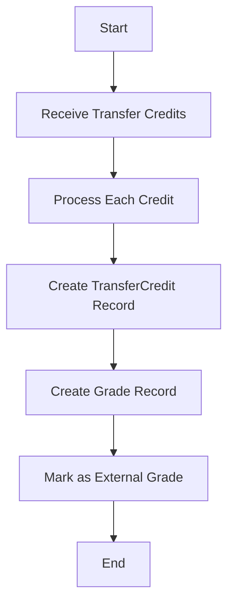
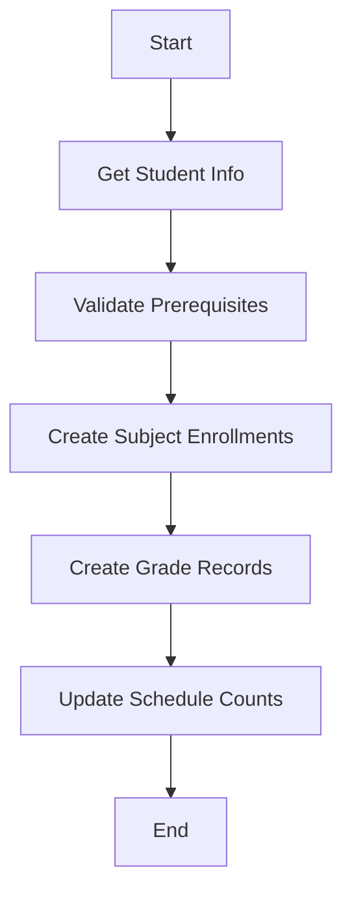
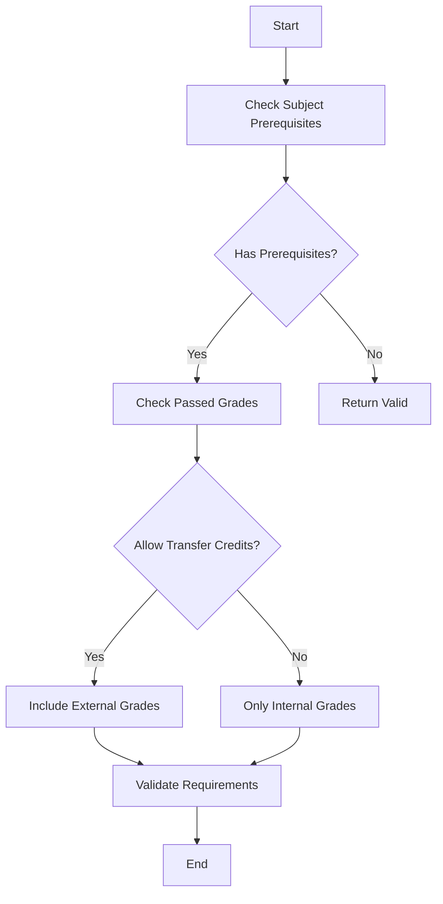
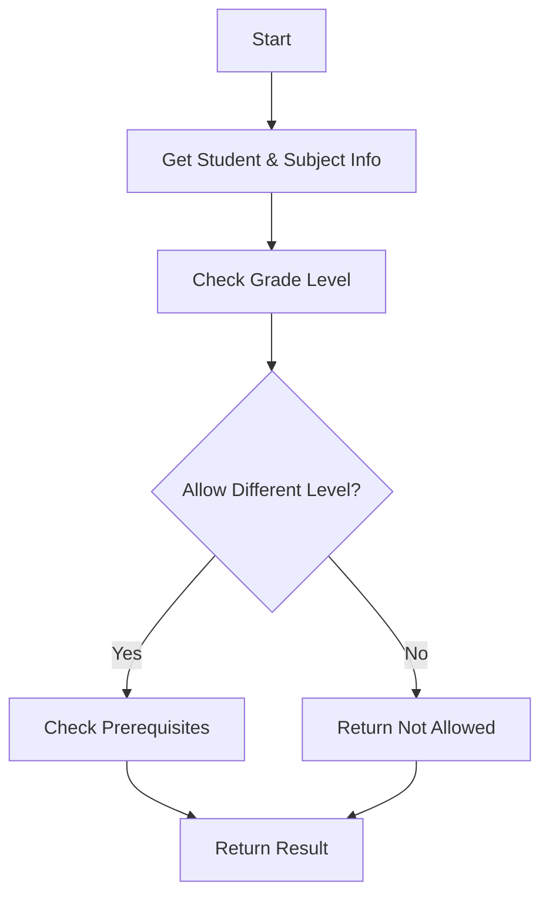

# TransfereeService Documentation

## Overview
The TransfereeService handles all operations related to transferee students in the academic system, including processing transfer credits, managing subject enrollments, and validating prerequisites. This service is essential for managing students transferring from other institutions.

## When to Use
Use this service when:
1. Processing a new transferee student's admission
2. Evaluating transfer credits from previous institutions
3. Enrolling transferee students in subjects
4. Checking subject eligibility for transferee students
5. Getting recommended subjects for transferee students

## Service Flow

### 1. Transfer Credit Processing Flow


#### Steps:
1. Collect transfer credit information:
   - Subject ID
   - Previous school name
   - Previous grade
   - Previous school year
   - Supporting documents

2. Process transfer credits:
```typescript
const transfereeService = new TransfereeService(prisma);
const credits = [{
    subjectId: "subject-id",
    previousSchoolName: "Previous School",
    previousGrade: 85,
    previousSchoolYear: "2022-2023",
    documents: ["url-to-document"]
}];

await transfereeService.processTransferCredits(
    studentId,
    credits,
    processedById
);
```

### 2. Subject Enrollment Flow


#### Steps:
1. Prepare enrollment information:
```typescript
const enrollmentData = {
    studentId: "student-id",
    enrollmentId: "enrollment-id",
    subjects: [{
        subjectId: "subject-id",
        scheduleId: "schedule-id"
    }],
    schoolYearId: "school-year-id",
    semesterId: "semester-id" // Optional
};

await transfereeService.enrollStudent(enrollmentData);
```

### 3. Prerequisite Validation Flow


#### Usage:
```typescript
const validation = await transfereeService.validatePrerequisites(
    studentId,
    subjectId,
    {
        strict: true, // All prerequisites must be met
        allowTransferCredits: true // Consider transfer credits
    }
);
```

### 4. Subject Eligibility Check Flow


#### Usage:
```typescript
const eligibility = await transfereeService.canEnrollInSubject(
    studentId,
    subjectId,
    {
        checkPrerequisites: true,
        allowHigherLevel: true,
        allowLowerLevel: false
    }
);
```

## Best Practices

1. **Transfer Credit Processing**
   - Always verify documents before processing transfer credits
   - Keep original grade records from previous institution
   - Maintain clear documentation of transfer credit decisions

2. **Subject Enrollment**
   - Validate prerequisites before enrollment
   - Consider grade level restrictions
   - Check schedule capacity
   - Handle prerequisite overrides carefully

3. **Grade Level Management**
   - Verify student's current grade level
   - Consider academic term when processing transfers
   - Handle special cases for different education levels

4. **Error Handling**
   - Handle missing prerequisite scenarios
   - Manage schedule conflicts
   - Process grade level mismatches appropriately

## Common Use Cases

### 1. Processing a New Transferee
```typescript
// 1. Process transfer credits
await transfereeService.processTransferCredits(/*...*/);

// 2. Get recommended subjects
const recommendations = await transfereeService.getRecommendedSubjects(
    studentId,
    {
        schoolYearId: "current-year",
        maxUnits: 30,
        includeHigherLevel: false
    }
);

// 3. Enroll in subjects
await transfereeService.enrollStudent(/*...*/);
```

### 2. Checking Subject Eligibility
```typescript
// Check if student can take a subject
const eligibility = await transfereeService.canEnrollInSubject(
    studentId,
    subjectId,
    {
        checkPrerequisites: true,
        allowHigherLevel: false
    }
);

if (eligibility.allowed) {
    // Proceed with enrollment
} else {
    console.log(`Cannot enroll: ${eligibility.reason}`);
}
```

### 3. Viewing Transfer History
```typescript
const history = await transfereeService.getTransferHistory(studentId);
```

## Error Handling

The service throws errors in these cases:
1. Student not found
2. Subject not found
3. Invalid grade level
4. Missing prerequisites
5. Schedule capacity exceeded

Always wrap service calls in try-catch blocks:
```typescript
try {
    await transfereeService.processTransferCredits(/*...*/);
} catch (error) {
    console.error('Transfer credit processing failed:', error);
    // Handle error appropriately
}
```

## Integration Points

1. **Admission System**
   - Used during transferee admission process
   - Handles initial credit evaluation

2. **Enrollment System**
   - Manages subject enrollment
   - Validates prerequisites
   - Handles schedule assignments

3. **Grading System**
   - Records transfer credits
   - Maintains grade history

4. **Academic Records**
   - Tracks transfer credit history
   - Manages academic standing

## Performance Considerations

1. Use transactions for multi-step operations
2. Batch process transfer credits when possible
3. Cache frequently accessed data
4. Use indexes for common queries
5. Consider pagination for large result sets 